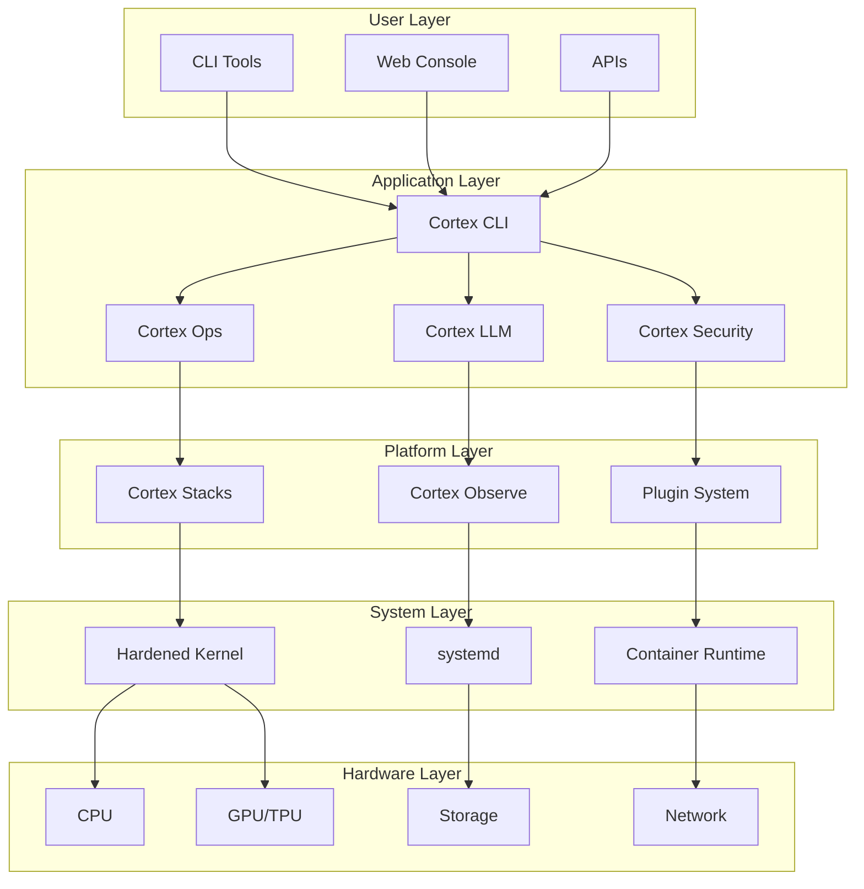
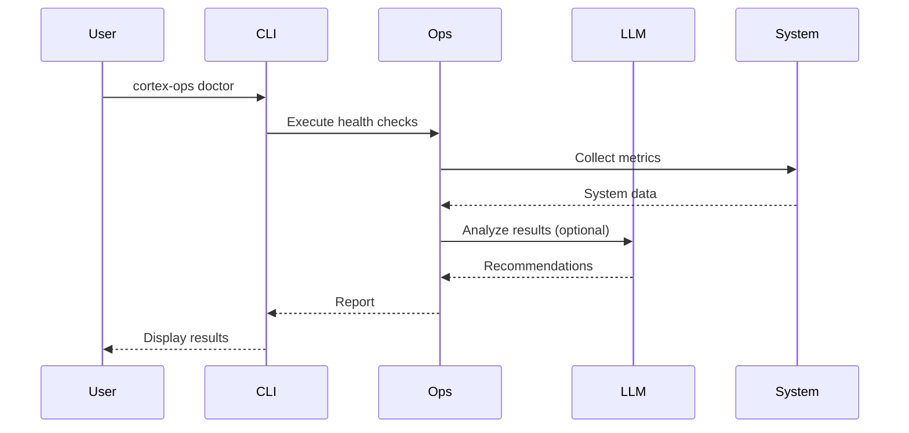
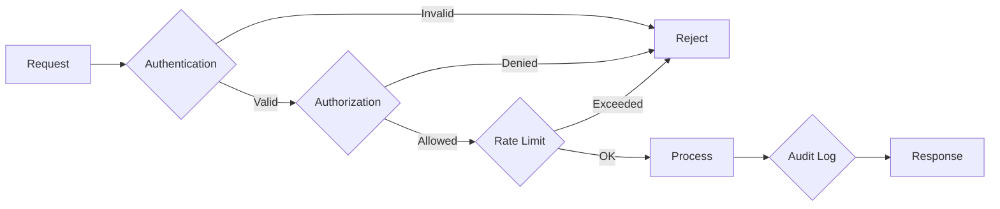

# Architecture Overview

Cortex Linux is built as a modular, layered system designed for AI workloads and modern infrastructure management.

## System Architecture



## Core Components

### Cortex CLI

The unified command-line interface that serves as the primary interaction point:

| Component | Purpose |
|-----------|---------|
| `cortex` | Main CLI entrypoint |
| `cortex-ops` | Operations and diagnostics |
| `cortex-llm` | LLM orchestration |
| `cortex-security` | Security management |

### Cortex Ops

System operations toolkit providing:

- **Doctor**: Health diagnostics with 12+ checks
- **Repair**: Auto-fix for common issues
- **Updates**: Orchestrated update management with rollback
- **Plugins**: Extensibility SDK

### Cortex LLM

LLM orchestration layer for AI workloads:

- **Connectors**: OpenAI, Anthropic, Google integration
- **Routing**: Intelligent model selection
- **Caching**: Response caching for cost optimization
- **Local Models**: Support for local LLM deployment

### Cortex Security

Security hardening and compliance:

- **Profiles**: Pre-built AppArmor/SELinux profiles
- **Audit**: Security event logging
- **Compliance**: CIS benchmark automation
- **Secrets**: Secure credential management

### Cortex Stacks

Container and Kubernetes orchestration:

- **Docker**: Container runtime management
- **Kubernetes**: K3s/K8s deployment
- **Helm**: Chart management
- **Registry**: Private container registry

### Cortex Observe

Monitoring and observability:

- **Metrics**: Prometheus-compatible metrics
- **Logs**: Centralized log aggregation
- **Traces**: Distributed tracing
- **Alerts**: Intelligent alerting

## Data Flow



## Directory Structure

```
/
├── etc/
│   └── cortex/
│       ├── config.yaml       # Main configuration
│       ├── plugins/          # Plugin directory
│       └── hooks/            # Lifecycle hooks
├── var/
│   ├── lib/cortex/          # Application data
│   ├── cache/cortex/        # Cache files
│   └── log/cortex/          # Log files
├── opt/
│   └── cortex/              # Optional packages
└── usr/
    ├── bin/
    │   ├── cortex           # Main CLI
    │   └── cortex-ops       # Ops CLI
    └── lib/cortex/          # Libraries
```

## Communication Patterns

### Internal Communication

Components communicate via:

1. **Unix Sockets**: Fast local IPC
2. **D-Bus**: System service communication
3. **gRPC**: High-performance RPC

### External Communication

External integrations use:

1. **REST APIs**: Standard HTTP/JSON
2. **WebSockets**: Real-time streaming
3. **GraphQL**: Flexible queries (planned)

## Security Model



### Authentication

- API key authentication for CLI tools
- OAuth2/OIDC for web interfaces
- mTLS for service-to-service

### Authorization

- Role-Based Access Control (RBAC)
- Attribute-Based Access Control (ABAC)
- Namespace isolation

### Audit

- All actions logged to audit trail
- Tamper-evident log storage
- Real-time alerting on anomalies

## Deployment Models

### Single Node

All components on one machine:

```
┌─────────────────────────────────┐
│         Cortex Linux            │
├─────────────────────────────────┤
│  CLI │ Ops │ LLM │ Security    │
├─────────────────────────────────┤
│          Linux Kernel           │
└─────────────────────────────────┘
```

### Clustered

Distributed across multiple nodes:

```
┌─────────────┐  ┌─────────────┐  ┌─────────────┐
│   Control   │  │   Worker    │  │   Worker    │
│    Plane    │  │   Node 1    │  │   Node 2    │
├─────────────┤  ├─────────────┤  ├─────────────┤
│ API Server  │  │ Workloads   │  │ Workloads   │
│ Scheduler   │  │ GPU Tasks   │  │ CPU Tasks   │
│ etcd        │  │ Storage     │  │ Storage     │
└─────────────┘  └─────────────┘  └─────────────┘
        │               │               │
        └───────────────┼───────────────┘
                        │
                  ┌─────┴─────┐
                  │  Network  │
                  └───────────┘
```

## Extension Points

Cortex Linux can be extended at multiple levels:

| Level | Mechanism | Use Case |
|-------|-----------|----------|
| CLI | Plugins | Add new commands |
| Ops | Check Plugins | Custom health checks |
| LLM | Connectors | New LLM providers |
| Security | Policies | Custom security rules |
| System | Hooks | Lifecycle automation |

## Technology Stack

| Layer | Technology |
|-------|------------|
| Language | Python 3.11+, Rust, Go |
| CLI | Typer, Rich |
| HTTP | httpx, FastAPI |
| Database | SQLite, PostgreSQL |
| Cache | Redis (optional) |
| Queue | Redis, RabbitMQ |
| Containers | Docker, containerd |
| Orchestration | Kubernetes (K3s) |
| Monitoring | Prometheus, Grafana |

## Design Principles

1. **Modularity**: Components are loosely coupled and independently deployable
2. **Security First**: All defaults are secure, opt-in for less restrictive modes
3. **Observable**: Comprehensive metrics, logs, and traces by default
4. **Automation**: Prefer automated solutions over manual intervention
5. **Developer Experience**: Rich CLI output, clear error messages, excellent docs
