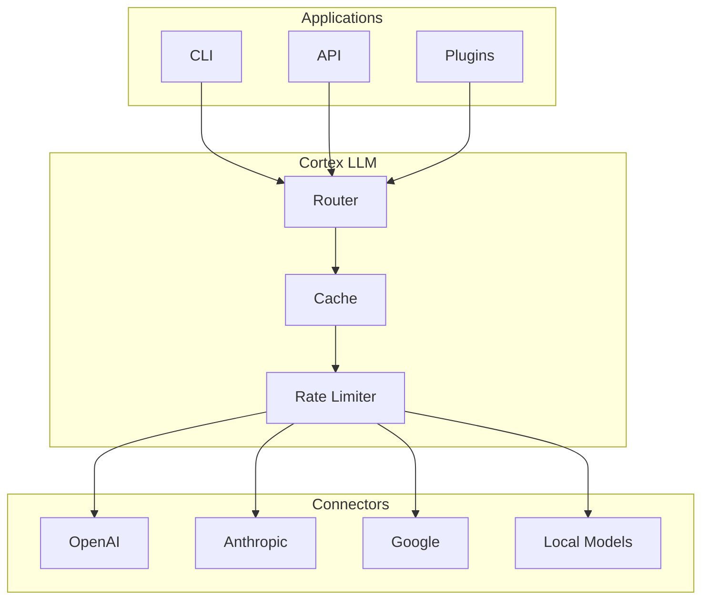
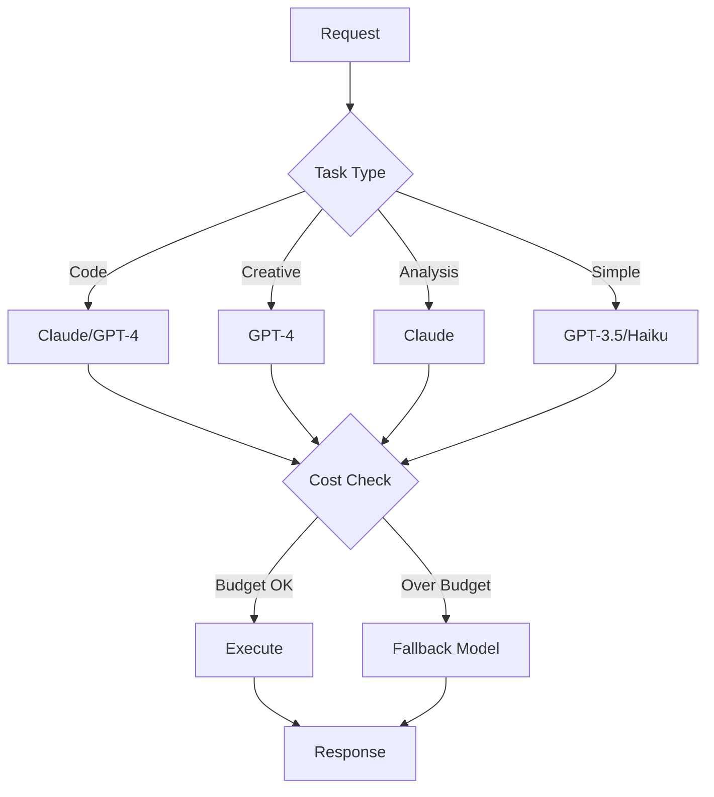
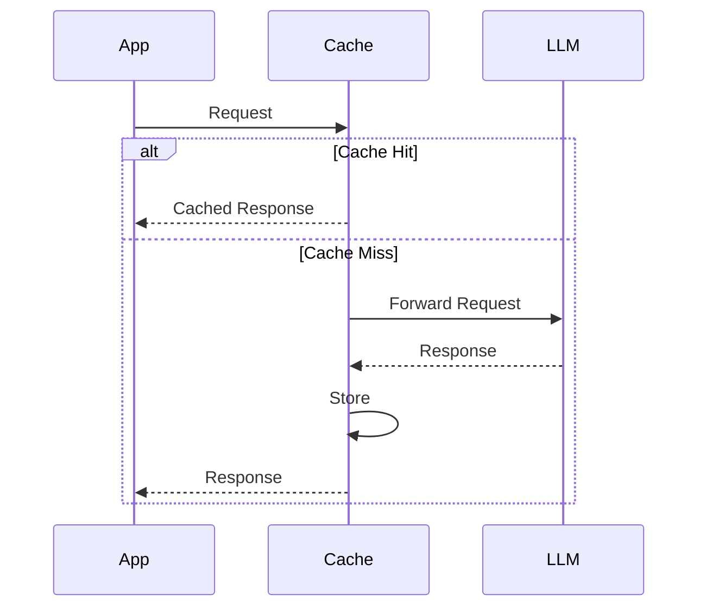

# Cortex LLM

Cortex LLM provides unified access to cloud and local LLM providers with intelligent routing, caching, and orchestration.

## Overview



## Architecture

### Core Components

| Component | Purpose |
|-----------|---------|
| **Router** | Intelligent model selection based on task |
| **Connectors** | Unified interface to LLM providers |
| **Cache** | Response caching for cost optimization |
| **Rate Limiter** | Request throttling and quota management |
| **Fallback** | Automatic failover between providers |

### Connector Interface

All connectors implement a common interface:

```python
from abc import ABC, abstractmethod
from dataclasses import dataclass

@dataclass
class Message:
    role: str  # system, user, assistant
    content: str

@dataclass
class Response:
    content: str
    model: str
    usage: dict[str, int]

class Connector(ABC):
    @abstractmethod
    async def chat(self, messages: list[Message]) -> Response:
        """Send chat completion request."""
        ...

    @abstractmethod
    async def complete(self, prompt: str) -> Response:
        """Send completion request."""
        ...

    @abstractmethod
    async def test_connection(self) -> tuple[bool, str]:
        """Test API connectivity."""
        ...
```

## Connectors

### OpenAI

```python
from cortex_llm.connectors import OpenAIConnector, ConnectorConfig

config = ConnectorConfig(
    api_key="sk-...",
    model="gpt-4-turbo-preview",
    temperature=0.7,
    max_tokens=4096,
)

connector = OpenAIConnector(config)

response = await connector.chat([
    Message(role="system", content="You are a helpful assistant."),
    Message(role="user", content="Hello!"),
])
```

Supported models:

- `gpt-4-turbo-preview`
- `gpt-4`
- `gpt-3.5-turbo`
- Custom fine-tuned models

### Anthropic

```python
from cortex_llm.connectors import AnthropicConnector, ConnectorConfig

config = ConnectorConfig(
    api_key="sk-ant-...",
    model="claude-3-opus-20240229",
)

connector = AnthropicConnector(config)

response = await connector.chat([
    Message(role="user", content="Explain quantum computing"),
])
```

Supported models:

- `claude-3-opus-20240229`
- `claude-3-sonnet-20240229`
- `claude-3-haiku-20240307`
- `claude-2.1`

### Google Gemini

```python
from cortex_llm.connectors import GoogleConnector, ConnectorConfig

config = ConnectorConfig(
    api_key="AIza...",
    model="gemini-pro",
)

connector = GoogleConnector(config)
```

Supported models:

- `gemini-pro`
- `gemini-pro-vision`

### Local Models

```python
from cortex_llm.connectors import LocalConnector, ConnectorConfig

config = ConnectorConfig(
    base_url="http://localhost:11434",  # Ollama
    model="llama2:70b",
)

connector = LocalConnector(config)
```

Supported backends:

- Ollama
- llama.cpp
- vLLM
- Text Generation Inference

## Configuration

### YAML Configuration

```yaml
# /etc/cortex/config.yaml
connectors:
  default: anthropic

  openai:
    api_key: ${OPENAI_API_KEY}
    model: gpt-4-turbo-preview
    timeout: 60
    max_tokens: 4096
    temperature: 0.7

  anthropic:
    api_key: ${ANTHROPIC_API_KEY}
    model: claude-3-opus-20240229
    timeout: 60
    max_tokens: 4096

  google:
    api_key: ${GOOGLE_API_KEY}
    model: gemini-pro

  local:
    base_url: http://localhost:11434
    model: mixtral:8x7b
```

### Environment Variables

```bash
export OPENAI_API_KEY="sk-..."
export ANTHROPIC_API_KEY="sk-ant-..."
export GOOGLE_API_KEY="AIza..."
export CORTEX_CONNECTORS__DEFAULT="anthropic"
```

## Intelligent Routing

The router selects the optimal model based on:



### Router Configuration

```yaml
router:
  enabled: true
  rules:
    - match:
        task: code
        complexity: high
      prefer: [claude-3-opus, gpt-4-turbo]

    - match:
        task: creative
      prefer: [gpt-4-turbo, claude-3-opus]

    - match:
        task: simple
        latency: critical
      prefer: [gpt-3.5-turbo, claude-3-haiku]

  fallback:
    - anthropic
    - openai
    - local
```

## Caching

### Cache Strategy



### Cache Configuration

```yaml
cache:
  enabled: true
  backend: redis  # redis, sqlite, memory
  ttl_seconds: 3600
  max_size_mb: 500

  # What to cache
  cache_completions: true
  cache_embeddings: true

  # Cache key includes
  key_includes:
    - model
    - messages_hash
    - temperature
```

### Redis Setup

```bash
# Install Redis
sudo apt install redis-server

# Configure
sudo systemctl enable redis-server
sudo systemctl start redis-server

# Verify
redis-cli ping
```

## Rate Limiting

### Configuration

```yaml
rate_limits:
  openai:
    requests_per_minute: 60
    tokens_per_minute: 90000

  anthropic:
    requests_per_minute: 50
    tokens_per_minute: 100000

  global:
    requests_per_minute: 100
    cost_per_day_usd: 50
```

### Quota Alerts

```yaml
alerts:
  - type: quota
    threshold: 80%
    action: notify

  - type: quota
    threshold: 95%
    action: throttle

  - type: cost
    threshold: 40  # USD
    action: notify
```

## Streaming

### Stream Responses

```python
from cortex_llm import get_manager

manager = get_manager()

async for chunk in manager.chat_stream([
    Message(role="user", content="Write a poem"),
]):
    print(chunk.content, end="", flush=True)

print()  # Final newline
```

### WebSocket Streaming

```python
# Server
@app.websocket("/ws/chat")
async def websocket_chat(websocket: WebSocket):
    await websocket.accept()

    messages = await websocket.receive_json()

    async for chunk in manager.chat_stream(messages):
        await websocket.send_json({
            "type": "chunk",
            "content": chunk.content,
        })

    await websocket.send_json({"type": "done"})
```

## Function Calling

### Tool Definition

```python
tools = [
    {
        "type": "function",
        "function": {
            "name": "get_weather",
            "description": "Get current weather for a location",
            "parameters": {
                "type": "object",
                "properties": {
                    "location": {
                        "type": "string",
                        "description": "City name",
                    }
                },
                "required": ["location"],
            },
        },
    }
]

response = await connector.chat(
    messages=[Message(role="user", content="What's the weather in Tokyo?")],
    tools=tools,
)

if response.tool_calls:
    for call in response.tool_calls:
        result = execute_tool(call.function.name, call.function.arguments)
        # Continue conversation with tool result
```

## Embeddings

### Generate Embeddings

```python
from cortex_llm import EmbeddingConnector

embedder = EmbeddingConnector(model="text-embedding-3-small")

# Single text
embedding = await embedder.embed("Hello, world!")

# Batch
embeddings = await embedder.embed_batch([
    "First document",
    "Second document",
    "Third document",
])
```

### Vector Search

```python
import numpy as np

def cosine_similarity(a, b):
    return np.dot(a, b) / (np.linalg.norm(a) * np.linalg.norm(b))

query_embedding = await embedder.embed("search query")

similarities = [
    cosine_similarity(query_embedding, doc_emb)
    for doc_emb in document_embeddings
]

top_indices = np.argsort(similarities)[-5:][::-1]
```

## Error Handling

### Retry Logic

```python
from cortex_llm.retry import RetryConfig

config = RetryConfig(
    max_retries=3,
    initial_delay=1.0,
    max_delay=30.0,
    exponential_base=2,
    retry_on=[
        "rate_limit_exceeded",
        "server_error",
        "timeout",
    ],
)

response = await connector.chat(messages, retry_config=config)
```

### Fallback Chain

```python
from cortex_llm import FallbackChain

chain = FallbackChain([
    AnthropicConnector(config_anthropic),
    OpenAIConnector(config_openai),
    LocalConnector(config_local),
])

# Automatically tries next connector on failure
response = await chain.chat(messages)
```

## Monitoring

### Metrics

```python
# Prometheus metrics
from prometheus_client import Counter, Histogram

llm_requests = Counter(
    "cortex_llm_requests_total",
    "Total LLM requests",
    ["provider", "model", "status"],
)

llm_latency = Histogram(
    "cortex_llm_request_duration_seconds",
    "LLM request latency",
    ["provider", "model"],
)

llm_tokens = Counter(
    "cortex_llm_tokens_total",
    "Total tokens used",
    ["provider", "model", "type"],
)
```

### Cost Tracking

```yaml
cost_tracking:
  enabled: true
  export:
    - type: csv
      path: /var/log/cortex/llm-costs.csv
    - type: prometheus
      endpoint: /metrics
```
