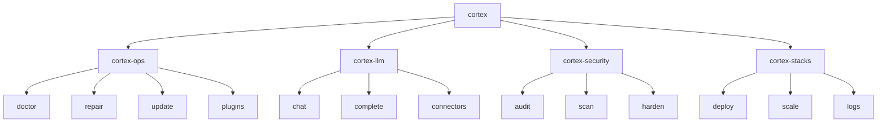

# Cortex CLI

The Cortex CLI is the primary interface for interacting with Cortex Linux systems.

## Overview



## Architecture

### Component Design

The CLI is built using a modular architecture:

```
cortex-cli/
├── cortex_cli/
│   ├── __init__.py
│   ├── main.py          # Entry point
│   ├── commands/        # Command modules
│   │   ├── ops.py
│   │   ├── llm.py
│   │   ├── security.py
│   │   └── stacks.py
│   ├── core/           # Core functionality
│   │   ├── config.py
│   │   ├── output.py
│   │   └── auth.py
│   └── utils/          # Utilities
│       ├── system.py
│       └── network.py
└── pyproject.toml
```

### Technology Stack

| Component | Technology |
|-----------|------------|
| Framework | Typer |
| Output | Rich |
| HTTP Client | httpx |
| Config | Pydantic |
| Async | asyncio |

## Command Structure

### Global Options

All commands support these global options:

```bash
cortex [OPTIONS] COMMAND [ARGS]

Options:
  --config PATH    Path to config file
  --debug          Enable debug mode
  --json           Output as JSON
  --quiet          Suppress non-essential output
  --version        Show version
  --help           Show help
```

### Command Hierarchy

```
cortex
├── status              # System status overview
├── config              # Configuration management
│   ├── show            # Show current config
│   ├── set             # Set config value
│   └── validate        # Validate config
├── support-bundle      # Generate support bundle
└── version             # Show version info

cortex-ops
├── doctor              # Health diagnostics
│   ├── (default)       # Run all checks
│   └── list            # List available checks
├── repair              # System repair
│   ├── apt             # Fix APT issues
│   ├── permissions     # Fix permissions
│   └── services        # Fix services
├── update              # Update management
│   ├── check           # Check for updates
│   ├── apply           # Apply updates
│   └── rollback        # Rollback updates
├── plugins             # Plugin management
│   ├── list            # List plugins
│   ├── install         # Install plugin
│   ├── create          # Create plugin scaffold
│   ├── enable          # Enable plugin
│   └── disable         # Disable plugin
└── connectors          # LLM connectors
    ├── list            # List connectors
    ├── test            # Test connector
    └── set-default     # Set default connector
```

## Output Formatting

### Rich Terminal Output

The CLI uses Rich for beautiful terminal output:

```python
from rich.console import Console
from rich.table import Table
from rich.panel import Panel

console = Console()

# Tables
table = Table(title="System Status")
table.add_column("Component", style="cyan")
table.add_column("Status", style="green")
table.add_row("CLI", "✓ Active")
console.print(table)

# Panels
console.print(Panel("Welcome to Cortex", title="Info"))

# Progress
with console.status("Working..."):
    # long operation
    pass
```

### JSON Output

All commands support JSON output for scripting:

```bash
# Get JSON output
cortex-ops doctor --json

# Parse with jq
cortex-ops doctor --json | jq '.summary.failed'

# Use in scripts
if cortex-ops doctor --json | jq -e '.summary.success' > /dev/null; then
    echo "System healthy"
fi
```

## Error Handling

### Exit Codes

| Code | Meaning |
|------|---------|
| 0 | Success |
| 1 | General error |
| 2 | Invalid arguments |
| 3 | Configuration error |
| 4 | Authentication error |
| 5 | Network error |
| 10 | Check failures (doctor) |

### Error Messages

Errors are displayed with context:

```
Error: Failed to connect to API

Details:
  - URL: https://api.example.com
  - Status: Connection refused

Suggestions:
  1. Check network connectivity
  2. Verify the API URL in config
  3. Run: cortex-ops doctor --check network_connectivity
```

## Configuration

### Config File Locations

```python
# Search order (first found wins)
CONFIG_PATHS = [
    Path("./cortex.yaml"),                    # Local
    Path.home() / ".config/cortex/config.yaml", # User
    Path("/etc/cortex/config.yaml"),          # System
]
```

### Environment Variables

```bash
# All config options can be set via env vars
export CORTEX_DEBUG=true
export CORTEX_LOG_LEVEL=DEBUG
export CORTEX_CONNECTORS__DEFAULT=anthropic
```

## Authentication

### API Key Authentication

```bash
# Set API key
export CORTEX_API_KEY="ctx-your-key"

# Or in config
echo "api_key: ctx-your-key" >> ~/.config/cortex/config.yaml
```

### Keyring Integration

For secure credential storage:

```python
import keyring

# Store credential
keyring.set_password("cortex", "api_key", "ctx-secret")

# Retrieve credential
api_key = keyring.get_password("cortex", "api_key")
```

## Plugin System

### Plugin Interface

Plugins extend CLI functionality:

```python
from cortex_cli.plugins import CommandPlugin, PluginInfo

class MyPlugin(CommandPlugin):
    @property
    def info(self) -> PluginInfo:
        return PluginInfo(
            name="my-plugin",
            version="1.0.0",
            description="Adds custom commands",
        )

    def get_commands(self):
        return [self.hello]

    def hello(self, name: str = "World"):
        """Say hello."""
        print(f"Hello, {name}!")
```

### Loading Plugins

Plugins are loaded from:

1. `/etc/cortex/plugins/`
2. `~/.config/cortex/plugins/`
3. Explicitly via `--plugin` flag

## Async Operations

The CLI supports async operations for better performance:

```python
import asyncio
from cortex_cli.core import async_command

@async_command
async def check_all():
    """Run all checks concurrently."""
    tasks = [
        check_disk(),
        check_memory(),
        check_network(),
    ]
    results = await asyncio.gather(*tasks)
    return results
```

## Shell Completion

### Installation

=== "Bash"

    ```bash
    cortex --install-completion bash
    source ~/.bashrc
    ```

=== "Zsh"

    ```bash
    cortex --install-completion zsh
    source ~/.zshrc
    ```

=== "Fish"

    ```bash
    cortex --install-completion fish
    ```

### Usage

After installation:

```bash
cortex-ops doc<TAB>    # Completes to "doctor"
cortex-ops doctor --<TAB>  # Shows available flags
```

## Scripting

### Using in Scripts

```bash
#!/bin/bash
set -e

# Run doctor and capture result
if ! cortex-ops doctor --quiet; then
    echo "Health check failed!"
    cortex-ops doctor --json > /tmp/health-report.json
    exit 1
fi

# Check specific condition
disk_usage=$(cortex-ops doctor --json | jq -r '.results[] | select(.check_id=="disk_space") | .details.percent_used')
if (( $(echo "$disk_usage > 90" | bc -l) )); then
    echo "Disk usage critical: ${disk_usage}%"
    cortex-ops repair apt --clean-cache
fi
```

### CI/CD Integration

```yaml
# GitHub Actions example
- name: Health Check
  run: |
    cortex-ops doctor --json > health.json
    if ! jq -e '.summary.success' health.json; then
      echo "::error::Health check failed"
      exit 1
    fi
```

## Performance

### Lazy Loading

Commands are lazy-loaded for fast startup:

```python
# Commands only loaded when invoked
@app.command()
def expensive_command():
    # Heavy imports here, not at module level
    from cortex_cli.heavy import process
    process()
```

### Caching

Results are cached where appropriate:

```bash
# Force fresh check (bypass cache)
cortex-ops update check --force

# Use cached result (default)
cortex-ops update check
```

## Development

### Running Locally

```bash
# Install in development mode
pip install -e ".[dev]"

# Run CLI
python -m cortex_cli

# Run tests
pytest tests/ -v
```

### Adding Commands

```python
# cortex_cli/commands/new_command.py
import typer

app = typer.Typer()

@app.command()
def new_feature(
    option: str = typer.Option("default", help="An option"),
):
    """Description of new feature."""
    typer.echo(f"Running with {option}")
```

Register in main:

```python
from cortex_cli.commands import new_command
app.add_typer(new_command.app, name="new")
```
