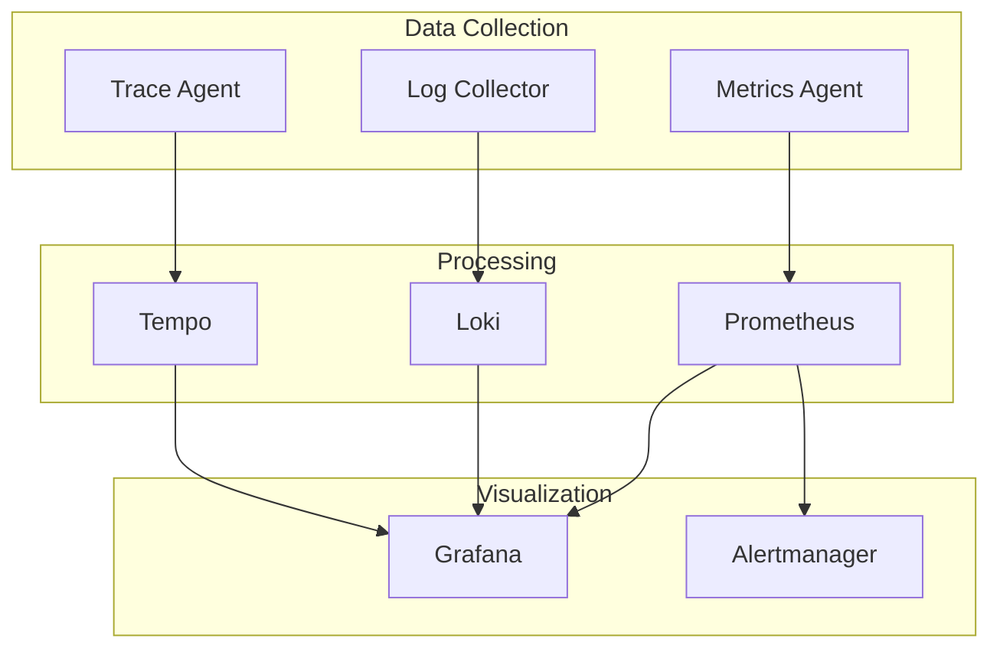

# CX Observe

CX Observe provides comprehensive monitoring, logging, and observability for CX Linux systems.

## Overview



## Metrics

### Prometheus Setup

```yaml
# /etc/prometheus/prometheus.yml
global:
  scrape_interval: 15s
  evaluation_interval: 15s

alerting:
  alertmanagers:
    - static_configs:
        - targets:
          - alertmanager:9093

rule_files:
  - /etc/prometheus/rules/*.yml

scrape_configs:
  - job_name: 'prometheus'
    static_configs:
      - targets: ['localhost:9090']

  - job_name: 'cx'
    static_configs:
      - targets: ['localhost:8080']
    metrics_path: /metrics

  - job_name: 'node'
    static_configs:
      - targets: ['localhost:9100']

  - job_name: 'kubernetes-pods'
    kubernetes_sd_configs:
      - role: pod
    relabel_configs:
      - source_labels: [__meta_kubernetes_pod_annotation_prometheus_io_scrape]
        action: keep
        regex: true
```

### Node Exporter

```bash
# Install node exporter
sudo apt install prometheus-node-exporter

# Enable and start
sudo systemctl enable prometheus-node-exporter
sudo systemctl start prometheus-node-exporter

# Verify metrics
curl http://localhost:9100/metrics
```

### Custom Metrics

```python
from prometheus_client import Counter, Histogram, Gauge, start_http_server

# Define metrics
requests_total = Counter(
    'cx_requests_total',
    'Total requests',
    ['method', 'endpoint', 'status']
)

request_duration = Histogram(
    'cx_request_duration_seconds',
    'Request duration',
    ['method', 'endpoint'],
    buckets=[0.01, 0.05, 0.1, 0.5, 1.0, 5.0]
)

active_connections = Gauge(
    'cx_active_connections',
    'Active connections'
)

# Start metrics server
start_http_server(8080)

# Record metrics
requests_total.labels(method='GET', endpoint='/api', status='200').inc()
request_duration.labels(method='GET', endpoint='/api').observe(0.125)
active_connections.set(42)
```

### PromQL Queries

```promql
# CPU usage percentage
100 - (avg by(instance) (irate(node_cpu_seconds_total{mode="idle"}[5m])) * 100)

# Memory usage percentage
(1 - (node_memory_MemAvailable_bytes / node_memory_MemTotal_bytes)) * 100

# Disk usage percentage
(1 - (node_filesystem_avail_bytes{mountpoint="/"} / node_filesystem_size_bytes{mountpoint="/"})) * 100

# Request rate
rate(cx_requests_total[5m])

# 95th percentile latency
histogram_quantile(0.95, rate(cx_request_duration_seconds_bucket[5m]))

# Error rate
sum(rate(cx_requests_total{status=~"5.."}[5m])) / sum(rate(cx_requests_total[5m]))
```

## Logging

### Loki Setup

```yaml
# /etc/loki/loki-config.yaml
auth_enabled: false

server:
  http_listen_port: 3100
  grpc_listen_port: 9096

common:
  path_prefix: /var/lib/loki
  storage:
    filesystem:
      chunks_directory: /var/lib/loki/chunks
      rules_directory: /var/lib/loki/rules
  replication_factor: 1
  ring:
    kvstore:
      store: inmemory

schema_config:
  configs:
    - from: 2020-10-24
      store: boltdb-shipper
      object_store: filesystem
      schema: v11
      index:
        prefix: index_
        period: 24h

ruler:
  alertmanager_url: http://alertmanager:9093

limits_config:
  enforce_metric_name: false
  reject_old_samples: true
  reject_old_samples_max_age: 168h
```

### Promtail Agent

```yaml
# /etc/promtail/promtail-config.yaml
server:
  http_listen_port: 9080
  grpc_listen_port: 0

positions:
  filename: /var/lib/promtail/positions.yaml

clients:
  - url: http://loki:3100/loki/api/v1/push

scrape_configs:
  - job_name: system
    static_configs:
      - targets:
          - localhost
        labels:
          job: varlogs
          __path__: /var/log/*.log

  - job_name: cx
    static_configs:
      - targets:
          - localhost
        labels:
          job: cx
          __path__: /var/log/cx/*.log
    pipeline_stages:
      - json:
          expressions:
            level: level
            message: msg
            timestamp: time
      - labels:
          level:
      - timestamp:
          source: timestamp
          format: RFC3339

  - job_name: journal
    journal:
      max_age: 12h
      labels:
        job: systemd-journal
    relabel_configs:
      - source_labels: ['__journal__systemd_unit']
        target_label: unit
```

### LogQL Queries

```logql
# All error logs
{job="cx"} |= "error"

# JSON log parsing
{job="cx"} | json | level="error"

# Rate of errors
rate({job="cx"} |= "error" [5m])

# Top error messages
{job="cx"} | json | level="error" | line_format "{{.message}}"

# Logs with specific field
{job="cx"} | json | request_id="abc123"

# Pattern matching
{job="cx"} |~ "failed to connect.*timeout"
```

## Tracing

### Tempo Setup

```yaml
# /etc/tempo/tempo-config.yaml
server:
  http_listen_port: 3200

distributor:
  receivers:
    otlp:
      protocols:
        grpc:
          endpoint: 0.0.0.0:4317
        http:
          endpoint: 0.0.0.0:4318
    jaeger:
      protocols:
        thrift_http:
          endpoint: 0.0.0.0:14268
        grpc:
          endpoint: 0.0.0.0:14250

storage:
  trace:
    backend: local
    local:
      path: /var/lib/tempo/traces
    wal:
      path: /var/lib/tempo/wal

querier:
  frontend_worker:
    frontend_address: localhost:9095
```

### OpenTelemetry Instrumentation

```python
from opentelemetry import trace
from opentelemetry.sdk.trace import TracerProvider
from opentelemetry.sdk.trace.export import BatchSpanProcessor
from opentelemetry.exporter.otlp.proto.grpc.trace_exporter import OTLPSpanExporter

# Setup tracing
provider = TracerProvider()
processor = BatchSpanProcessor(OTLPSpanExporter(endpoint="http://tempo:4317"))
provider.add_span_processor(processor)
trace.set_tracer_provider(provider)

tracer = trace.get_tracer(__name__)

# Create spans
with tracer.start_as_current_span("process_request") as span:
    span.set_attribute("user.id", "12345")
    span.set_attribute("request.method", "GET")

    with tracer.start_as_current_span("database_query"):
        # Database operation
        pass

    with tracer.start_as_current_span("external_api_call"):
        # API call
        pass
```

## Grafana

### Dashboard Configuration

```json
{
  "dashboard": {
    "title": "Cortex System Overview",
    "panels": [
      {
        "title": "CPU Usage",
        "type": "graph",
        "targets": [
          {
            "expr": "100 - (avg(irate(node_cpu_seconds_total{mode=\"idle\"}[5m])) * 100)",
            "legendFormat": "CPU %"
          }
        ]
      },
      {
        "title": "Memory Usage",
        "type": "gauge",
        "targets": [
          {
            "expr": "(1 - (node_memory_MemAvailable_bytes / node_memory_MemTotal_bytes)) * 100"
          }
        ]
      },
      {
        "title": "Request Rate",
        "type": "graph",
        "targets": [
          {
            "expr": "rate(cx_requests_total[5m])",
            "legendFormat": "{{method}} {{endpoint}}"
          }
        ]
      }
    ]
  }
}
```

### Data Sources

```yaml
# /etc/grafana/provisioning/datasources/datasources.yaml
apiVersion: 1

datasources:
  - name: Prometheus
    type: prometheus
    access: proxy
    url: http://prometheus:9090
    isDefault: true

  - name: Loki
    type: loki
    access: proxy
    url: http://loki:3100

  - name: Tempo
    type: tempo
    access: proxy
    url: http://tempo:3200
```

## Alerting

### Alert Rules

```yaml
# /etc/prometheus/rules/cx-alerts.yml
groups:
  - name: cx
    rules:
      - alert: HighCPUUsage
        expr: 100 - (avg(irate(node_cpu_seconds_total{mode="idle"}[5m])) * 100) > 80
        for: 5m
        labels:
          severity: warning
        annotations:
          summary: High CPU usage detected
          description: CPU usage is above 80% for 5 minutes

      - alert: HighMemoryUsage
        expr: (1 - (node_memory_MemAvailable_bytes / node_memory_MemTotal_bytes)) * 100 > 85
        for: 5m
        labels:
          severity: warning
        annotations:
          summary: High memory usage detected

      - alert: DiskSpaceLow
        expr: (1 - (node_filesystem_avail_bytes{mountpoint="/"} / node_filesystem_size_bytes{mountpoint="/"})) * 100 > 90
        for: 5m
        labels:
          severity: critical
        annotations:
          summary: Disk space critically low

      - alert: ServiceDown
        expr: up{job="cx"} == 0
        for: 1m
        labels:
          severity: critical
        annotations:
          summary: Cortex service is down
```

### Alertmanager

```yaml
# /etc/alertmanager/alertmanager.yml
global:
  smtp_smarthost: 'smtp.example.com:587'
  smtp_from: 'alerts@cortexlinux.com'

route:
  group_by: ['alertname', 'severity']
  group_wait: 30s
  group_interval: 5m
  repeat_interval: 4h
  receiver: 'default'
  routes:
    - match:
        severity: critical
      receiver: 'pagerduty'

receivers:
  - name: 'default'
    email_configs:
      - to: 'ops@example.com'

  - name: 'pagerduty'
    pagerduty_configs:
      - service_key: '<pagerduty-service-key>'

  - name: 'slack'
    slack_configs:
      - api_url: '<slack-webhook-url>'
        channel: '#alerts'
```

## CLI Commands

```bash
# View metrics
cx observe metrics --query 'up{job="cx"}'

# Search logs
cx observe logs --query '{job="cx"} |= "error"' --since 1h

# View traces
cx observe traces --service cx-api --since 1h

# Dashboard
cx observe dashboard

# Alert status
cx observe alerts
```

## Health Checks

```yaml
# Health check configuration
health:
  endpoints:
    - name: prometheus
      url: http://prometheus:9090/-/healthy
      interval: 30s

    - name: loki
      url: http://loki:3100/ready
      interval: 30s

    - name: grafana
      url: http://grafana:3000/api/health
      interval: 30s

  alerts:
    - condition: any_unhealthy
      action: notify
      channels: [slack, email]
```
