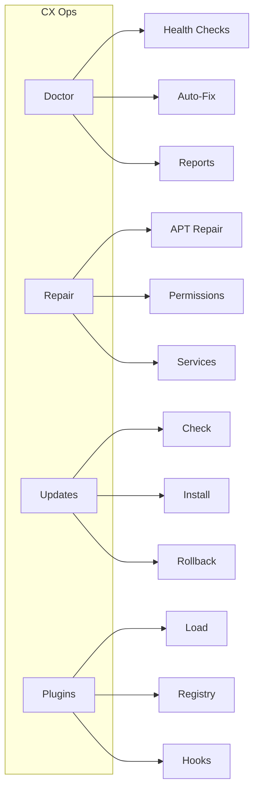
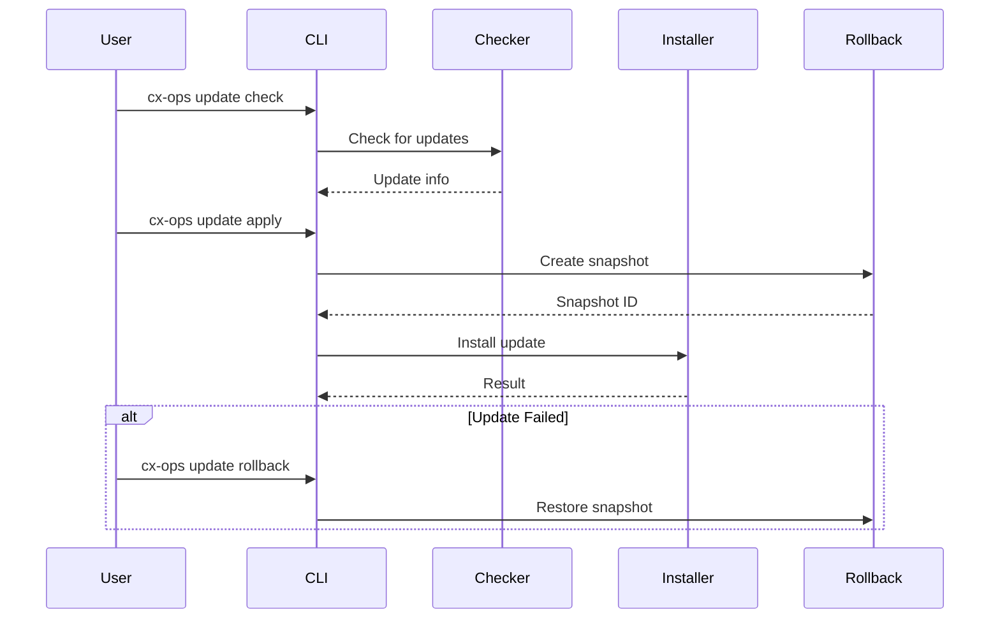
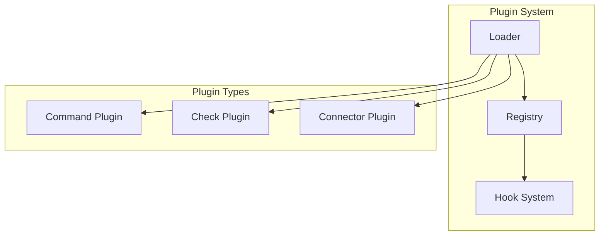

# CX Ops

CX Ops provides system diagnostics, repair tools, update management, and extensibility through plugins.

## Overview



## Doctor Module

### Health Checks

The doctor module includes 12+ built-in health checks:

| Check ID | Category | Description |
|----------|----------|-------------|
| `disk_space` | Disk | Root partition usage |
| `memory` | Memory | RAM utilization |
| `cpu_load` | Performance | CPU load average |
| `apt_status` | Packages | APT health |
| `systemd_failed` | Services | Failed units |
| `network_connectivity` | Network | Internet access |
| `dns_resolution` | Network | DNS lookup |
| `time_sync` | System | NTP status |
| `swap_usage` | Memory | Swap utilization |
| `security_updates` | Security | Pending updates |
| `zombie_processes` | Performance | Dead processes |
| `file_descriptors` | System | FD usage |

### Running Checks

```bash
# Run all checks
cx-ops doctor

# Run with auto-fix
cx-ops doctor --fix

# Run specific check
cx-ops doctor --check disk_space

# Filter by category
cx-ops doctor --category network

# JSON output
cx-ops doctor --json

# Verbose mode
cx-ops doctor --verbose
```

### Check Result Structure

```python
@dataclass
class CheckResult:
    check_id: str      # Unique identifier
    name: str          # Display name
    status: CheckStatus  # PASS, WARN, FAIL, SKIP, ERROR
    message: str       # Human-readable message
    details: dict      # Additional data
    fix_id: str | None # Associated fix action
    duration_ms: float # Execution time
```

### Creating Custom Checks

```python
from cx_ops.doctor import Check, CheckCategory, CheckSeverity, CheckResult, CheckStatus

def check_custom_service() -> CheckResult:
    """Check if custom service is running."""
    result = run_command(["systemctl", "is-active", "my-service"])

    if result.success:
        return CheckResult(
            check_id="custom_service",
            name="Custom Service",
            status=CheckStatus.PASS,
            message="Service is running",
        )
    else:
        return CheckResult(
            check_id="custom_service",
            name="Custom Service",
            status=CheckStatus.FAIL,
            message="Service is not running",
            fix_id="restart_custom_service",
        )

# Register check
custom_check = Check(
    id="custom_service",
    name="Custom Service",
    description="Verify custom service is running",
    category=CheckCategory.SERVICES,
    severity=CheckSeverity.HIGH,
    check_fn=check_custom_service,
    fix_id="restart_custom_service",
)
```

## Repair Module

### APT Repair

```bash
# Diagnose APT issues
cx-ops repair apt --dry-run

# Fix all APT issues
cx-ops repair apt

# Clear locks only
cx-ops repair apt --locks
```

Handles:

- Lock file conflicts
- Interrupted dpkg operations
- Broken package dependencies
- Corrupted package lists
- Cache issues

### Permissions Repair

```bash
# Check permissions
cx-ops repair permissions --dry-run

# Fix Cortex directories only
cx-ops repair permissions --cx

# Fix user home directory
cx-ops repair permissions --user developer
```

Fixes:

- Wrong file ownership
- Incorrect directory modes
- World-writable files in sensitive locations

### Services Repair

```bash
# Fix all service issues
cx-ops repair services

# Restart failed services only
cx-ops repair services --restart-failed

# Fix specific service
cx-ops repair services --service nginx
```

## Update Module

### Architecture



### Check for Updates

```bash
# Check all updates
cx-ops update check

# Force check (bypass cache)
cx-ops update check --force
```

Output:

```
╭─────────────────────────────────────────────╮
│              System Update                   │
├─────────────────────────────────────────────┤
│ Cortex 2024.2.0 available                   │
│ Released: 2024-01-15                        │
│ Security: Yes                               │
│ Reboot required: No                         │
╰─────────────────────────────────────────────╯

5 package update(s) available
2 security update(s)
```

### Apply Updates

```bash
# Apply system update
cx-ops update apply --system

# Apply package updates
cx-ops update apply --packages

# Security updates only
cx-ops update apply --packages --security

# Skip confirmation
cx-ops update apply --packages -y
```

### Rollback

```bash
# List available snapshots
cx-ops update rollback --list

# Rollback to latest snapshot
cx-ops update rollback

# Rollback to specific snapshot
cx-ops update rollback 20240115-120000
```

Snapshot data:

| Data | Backed Up |
|------|-----------|
| `/etc/cx/` | Configuration |
| `/var/lib/cx/` | Application data |
| Package list | For restoration |

## Plugin System

### Plugin Architecture



### Creating a Plugin

1. Create plugin directory:

```bash
cx-ops plugins create my-plugin --type command
```

2. Edit the generated files:

```python
# /etc/cx/plugins/my-plugin/__init__.py
from cx_ops.plugins import CommandPlugin, PluginInfo, PluginType

class MyPlugin(CommandPlugin):
    @property
    def info(self) -> PluginInfo:
        return PluginInfo(
            name="my-plugin",
            version="1.0.0",
            description="My custom plugin",
            author="Your Name",
            plugin_type=PluginType.COMMAND,
        )

    def activate(self) -> None:
        """Called when plugin loads."""
        print("Plugin activated!")

    def deactivate(self) -> None:
        """Called when plugin unloads."""
        print("Plugin deactivated!")

    def get_commands(self):
        return [self.my_command]

    def my_command(self, name: str = "World"):
        """My custom command."""
        print(f"Hello, {name}!")
```

3. Create plugin.yaml:

```yaml
# /etc/cx/plugins/my-plugin/plugin.yaml
name: my-plugin
version: 1.0.0
description: My custom plugin
author: Your Name
plugin_type: command
main: __init__.py
cx_version: ">=0.1.0"
```

### Plugin Management

```bash
# List installed plugins
cx-ops plugins list

# List available plugins
cx-ops plugins list --available

# Enable plugin
cx-ops plugins enable my-plugin

# Disable plugin
cx-ops plugins disable my-plugin
```

### Hook System

Plugins can hook into Cortex events:

```python
from cx_ops.plugins.hooks import hooks, HookPriority

@hooks.on("post_check", priority=HookPriority.HIGH)
def log_check_result(result):
    """Called after each health check."""
    if result.status == CheckStatus.FAIL:
        send_alert(f"Check failed: {result.name}")

@hooks.on("pre_fix")
def confirm_fix(fix):
    """Called before applying a fix."""
    return confirm(f"Apply fix: {fix.name}?")
```

Available hooks:

| Hook | Trigger |
|------|---------|
| `pre_check` | Before running a check |
| `post_check` | After running a check |
| `pre_fix` | Before applying a fix |
| `post_fix` | After applying a fix |
| `startup` | When cx-ops starts |
| `shutdown` | When cx-ops exits |
| `plugin_loaded` | After a plugin loads |

## Configuration

```yaml
# /etc/cx/config.yaml

# Doctor settings
doctor:
  timeout_seconds: 30     # Check timeout
  parallel_checks: true   # Run checks in parallel
  max_parallel: 4         # Max concurrent checks
  auto_fix_safe: false    # Auto-fix safe issues

# Update settings
updates:
  check_interval_hours: 24
  auto_check: true
  backup_before_update: true
  rollback_retention_days: 7
  channel: stable

# Plugin settings
plugins:
  enabled: true
  directory: /etc/cx/plugins
  auto_load: true
  trusted_sources:
    - cortexlinux
```

## Monitoring Integration

### Prometheus Metrics

```python
# Exposed at /metrics
cx_ops_checks_total{check="disk_space", status="pass"} 42
cx_ops_checks_total{check="disk_space", status="fail"} 3
cx_ops_check_duration_seconds{check="disk_space"} 0.234
cx_ops_repairs_total{type="apt"} 5
cx_ops_updates_applied_total{type="package"} 127
```

### Health Endpoint

```bash
# JSON health endpoint
curl http://localhost:8080/health

{
  "status": "healthy",
  "checks": {
    "disk_space": "pass",
    "memory": "pass",
    "cpu_load": "warn"
  },
  "timestamp": "2024-01-15T12:00:00Z"
}
```

### Alerting

```yaml
# alerts.yaml
alerts:
  - name: disk-critical
    check: disk_space
    status: fail
    actions:
      - type: email
        to: ops@example.com
      - type: pagerduty
        severity: critical

  - name: service-down
    check: systemd_failed
    status: fail
    actions:
      - type: slack
        channel: "#alerts"
```
