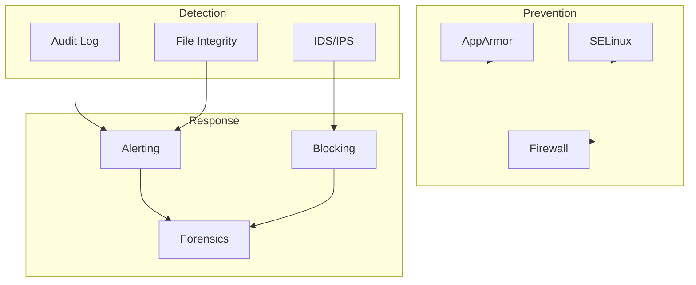

# CX Security

CX Security provides comprehensive security hardening, auditing, and compliance automation for CX Linux systems.

## Overview



## Security Architecture

### Defense in Depth

```
┌─────────────────────────────────────────────────────────┐
│                    Application Layer                     │
│  ┌─────────────────────────────────────────────────┐   │
│  │            Input Validation / WAF                │   │
│  └─────────────────────────────────────────────────┘   │
├─────────────────────────────────────────────────────────┤
│                     Runtime Layer                        │
│  ┌─────────────────────────────────────────────────┐   │
│  │        AppArmor / SELinux / Seccomp             │   │
│  └─────────────────────────────────────────────────┘   │
├─────────────────────────────────────────────────────────┤
│                     Network Layer                        │
│  ┌─────────────────────────────────────────────────┐   │
│  │           Firewall / Network Policies           │   │
│  └─────────────────────────────────────────────────┘   │
├─────────────────────────────────────────────────────────┤
│                      Host Layer                          │
│  ┌─────────────────────────────────────────────────┐   │
│  │         Hardened Kernel / Secure Boot           │   │
│  └─────────────────────────────────────────────────┘   │
└─────────────────────────────────────────────────────────┘
```

## AppArmor

### Profile Management

```bash
# List profiles
aa-status

# Load profile
apparmor_parser -r /etc/apparmor.d/cx-service

# Set profile mode
aa-enforce /etc/apparmor.d/cx-service
aa-complain /etc/apparmor.d/cx-service
```

### Example Profile

```
# /etc/apparmor.d/cx-service
#include <tunables/global>

profile cx-service /usr/bin/cx-service {
    #include <abstractions/base>
    #include <abstractions/nameservice>

    # Binary
    /usr/bin/cx-service mr,

    # Configuration
    /etc/cx/** r,

    # Data directories
    /var/lib/cx/ rw,
    /var/lib/cx/** rwk,

    # Logs
    /var/log/cx/** w,

    # Runtime
    /run/cx/ rw,
    /run/cx/** rwk,

    # Network
    network inet stream,
    network inet6 stream,

    # Deny sensitive access
    deny /etc/shadow r,
    deny /etc/sudoers r,
}
```

## SELinux

### Policy Management

```bash
# Check status
sestatus

# Set mode
sudo setenforce 1  # Enforcing
sudo setenforce 0  # Permissive

# Persistent mode change
sudo sed -i 's/SELINUX=.*/SELINUX=enforcing/' /etc/selinux/config
```

### Custom Policies

```bash
# Generate policy from audit log
audit2allow -a -M cx-custom

# Install module
semodule -i cx-custom.pp

# List modules
semodule -l | grep cx
```

### File Contexts

```bash
# Set context
chcon -t cx_data_t /var/lib/cx

# Restore default context
restorecon -Rv /var/lib/cx

# Add permanent rule
semanage fcontext -a -t cx_data_t '/var/lib/cx(/.*)?'
```

## Firewall

### UFW Configuration

```bash
# Enable firewall
sudo ufw enable

# Default policies
sudo ufw default deny incoming
sudo ufw default allow outgoing

# Allow specific services
sudo ufw allow ssh
sudo ufw allow 443/tcp
sudo ufw allow from 10.0.0.0/8 to any port 8080

# Deny specific
sudo ufw deny from 192.168.1.100

# View rules
sudo ufw status numbered
```

### Nftables Rules

```nft
#!/usr/sbin/nft -f

table inet filter {
    chain input {
        type filter hook input priority 0; policy drop;

        # Allow established
        ct state established,related accept

        # Allow loopback
        iif lo accept

        # Allow SSH
        tcp dport 22 accept

        # Allow HTTPS
        tcp dport 443 accept

        # Rate limit new connections
        ct state new limit rate 100/second accept
    }

    chain forward {
        type filter hook forward priority 0; policy drop;
    }

    chain output {
        type filter hook output priority 0; policy accept;
    }
}
```

## Audit Logging

### Auditd Configuration

```bash
# /etc/audit/rules.d/cx.rules

# Log all commands by root
-a always,exit -F arch=b64 -F euid=0 -S execve -k root_commands

# Monitor sensitive files
-w /etc/passwd -p wa -k identity
-w /etc/shadow -p wa -k identity
-w /etc/sudoers -p wa -k identity

# Monitor Cortex directories
-w /etc/cx/ -p wa -k cx_config
-w /var/lib/cx/ -p wa -k cx_data

# Monitor network configuration
-w /etc/hosts -p wa -k network_config
-w /etc/sysctl.conf -p wa -k sysctl

# Log all failed access attempts
-a always,exit -F arch=b64 -S open -F exit=-EACCES -k access_denied
-a always,exit -F arch=b64 -S open -F exit=-EPERM -k access_denied
```

### Viewing Audit Logs

```bash
# Search audit logs
ausearch -k cx_config

# Generate report
aureport -au  # Authentication
aureport -x   # Executables
aureport -f   # Files

# Real-time monitoring
tail -f /var/log/audit/audit.log | aureport -i
```

## Intrusion Detection

### AIDE Configuration

```bash
# /etc/aide/aide.conf

# Directories to monitor
/etc CONTENT_EX
/bin CONTENT_EX
/sbin CONTENT_EX
/usr/bin CONTENT_EX
/usr/sbin CONTENT_EX
/var/lib/cx CONTENT_EX

# Exclusions
!/var/log
!/var/cache
!/tmp

# Initialize database
aide --init
mv /var/lib/aide/aide.db.new /var/lib/aide/aide.db

# Run check
aide --check
```

### Fail2ban

```ini
# /etc/fail2ban/jail.local
[DEFAULT]
bantime = 3600
findtime = 600
maxretry = 5

[sshd]
enabled = true
port = ssh
filter = sshd
logpath = /var/log/auth.log

[cx-api]
enabled = true
port = 8080
filter = cx-api
logpath = /var/log/cx/access.log
maxretry = 10
```

## Secrets Management

### Environment Variables

```bash
# Secure method - use keyring
export CX_API_KEY=$(keyring get cx api_key)

# Or systemd credentials
systemd-creds encrypt --name=api-key plaintext.txt encrypted.cred
```

### HashiCorp Vault Integration

```python
import hvac

client = hvac.Client(url='https://vault.example.com:8200')
client.token = os.environ['VAULT_TOKEN']

# Read secret
secret = client.secrets.kv.v2.read_secret_version(
    path='cx/api-keys'
)
api_key = secret['data']['data']['openai']
```

### SOPS for Config Files

```bash
# Encrypt config file
sops --encrypt config.yaml > config.enc.yaml

# Decrypt on use
sops --decrypt config.enc.yaml

# Edit encrypted file
sops config.enc.yaml
```

## Secure Boot

### Enable Secure Boot

```bash
# Check status
mokutil --sb-state

# Import key
sudo mokutil --import /var/lib/shim-signed/mok/MOK.der

# Verify kernel signature
sbverify --cert /path/to/cert.pem /boot/vmlinuz-*
```

### Kernel Lockdown

```bash
# Check lockdown status
cat /sys/kernel/security/lockdown

# Enable via kernel parameter
# Add to GRUB_CMDLINE_LINUX in /etc/default/grub
GRUB_CMDLINE_LINUX="lockdown=confidentiality"

sudo update-grub
```

## Compliance Scanning

### CIS Benchmarks

```bash
# Run CIS scan
cx-security scan --benchmark cis-ubuntu-22.04

# Example output
CIS Ubuntu 22.04 Benchmark Scan
═══════════════════════════════════════════════════════

Section 1: Initial Setup
  [PASS] 1.1.1 Ensure mounting of cramfs is disabled
  [PASS] 1.1.2 Ensure mounting of freevxfs is disabled
  [FAIL] 1.1.3 Ensure mounting of jffs2 is disabled
        Remediation: echo "install jffs2 /bin/true" >> /etc/modprobe.d/jffs2.conf

Section 2: Services
  [PASS] 2.1.1 Ensure xinetd is not installed
  [WARN] 2.1.2 Ensure openbsd-inetd is not installed

Summary: 156 checks, 142 passed, 8 failed, 6 warnings
```

### Automated Remediation

```bash
# Auto-fix safe issues
cx-security harden --auto-fix --safe-only

# Generate remediation script
cx-security scan --output remediate.sh
chmod +x remediate.sh
./remediate.sh
```

## Security Events

### Event Types

| Event | Severity | Description |
|-------|----------|-------------|
| `AUTH_FAILURE` | High | Failed authentication |
| `PRIV_ESCALATION` | Critical | Privilege escalation attempt |
| `FILE_MODIFIED` | Medium | Config file changed |
| `PORT_SCAN` | Medium | Port scan detected |
| `MALWARE_DETECTED` | Critical | Malware signature match |

### Alert Configuration

```yaml
# /etc/cx/security/alerts.yaml
alerts:
  - name: auth-failures
    event: AUTH_FAILURE
    threshold: 5
    window: 300  # 5 minutes
    actions:
      - type: email
        to: security@example.com
      - type: slack
        webhook: ${SLACK_WEBHOOK}
      - type: block
        duration: 3600

  - name: priv-escalation
    event: PRIV_ESCALATION
    threshold: 1
    actions:
      - type: page
        service: pagerduty
      - type: isolate
```

## Security Hardening Checklist

```bash
# Run comprehensive hardening
cx-security harden

# Checklist applied:
✓ Disable root SSH login
✓ Configure SSH key-only authentication
✓ Enable UFW firewall
✓ Configure fail2ban
✓ Enable auditd logging
✓ Set secure file permissions
✓ Disable unused services
✓ Configure automatic security updates
✓ Enable AppArmor profiles
✓ Set kernel hardening parameters
```

See [Security Hardening Guide](../security/hardening.md) for detailed procedures.
