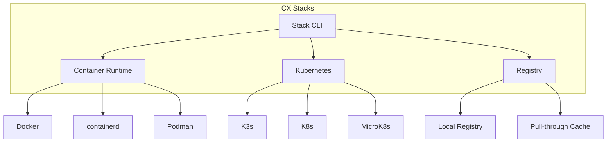
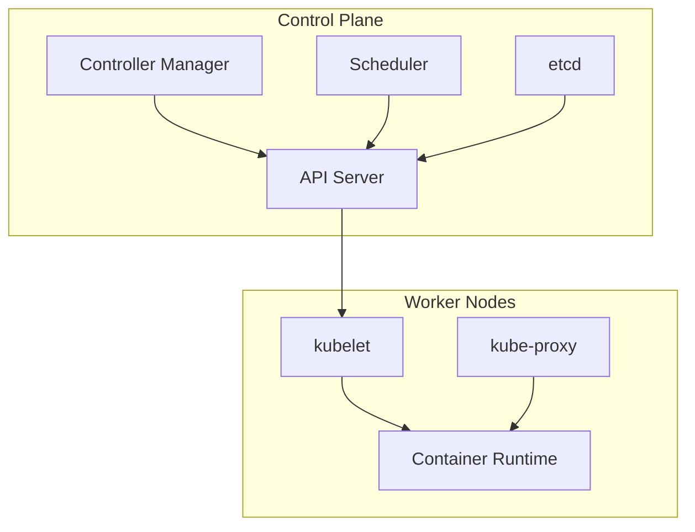

# CX Stacks

CX Stacks provides container orchestration and Kubernetes management for deploying applications on CX Linux.

## Overview



## Container Runtime

### Docker

```bash
# Check Docker status
systemctl status docker

# Run container
docker run -d --name nginx -p 80:80 nginx:latest

# List containers
docker ps -a

# View logs
docker logs nginx -f

# Execute in container
docker exec -it nginx /bin/bash
```

### containerd

```bash
# Check containerd status
systemctl status containerd

# Use with nerdctl
nerdctl run -d --name nginx -p 80:80 nginx:latest

# Or with ctr
ctr images pull docker.io/library/nginx:latest
ctr run docker.io/library/nginx:latest nginx
```

### Podman (Rootless)

```bash
# Run container as non-root
podman run -d --name nginx -p 8080:80 nginx:latest

# Generate systemd service
podman generate systemd --name nginx > ~/.config/systemd/user/nginx.service
systemctl --user enable nginx
```

## Kubernetes

### K3s (Lightweight)

```bash
# Install K3s
curl -sfL https://get.k3s.io | sh -

# Check status
systemctl status k3s
kubectl get nodes

# Deploy application
kubectl apply -f deployment.yaml

# Access dashboard
kubectl proxy
# http://localhost:8001/api/v1/namespaces/kubernetes-dashboard/services/https:kubernetes-dashboard:/proxy/
```

### Cluster Architecture



### Deployment Example

```yaml
# deployment.yaml
apiVersion: apps/v1
kind: Deployment
metadata:
  name: cx-app
  labels:
    app: cx-app
spec:
  replicas: 3
  selector:
    matchLabels:
      app: cx-app
  template:
    metadata:
      labels:
        app: cx-app
    spec:
      containers:
      - name: app
        image: cortexlinux/app:latest
        ports:
        - containerPort: 8080
        resources:
          requests:
            memory: "128Mi"
            cpu: "100m"
          limits:
            memory: "256Mi"
            cpu: "500m"
        livenessProbe:
          httpGet:
            path: /health
            port: 8080
          initialDelaySeconds: 10
          periodSeconds: 5
        readinessProbe:
          httpGet:
            path: /ready
            port: 8080
          initialDelaySeconds: 5
          periodSeconds: 3
---
apiVersion: v1
kind: Service
metadata:
  name: cx-app
spec:
  selector:
    app: cx-app
  ports:
  - port: 80
    targetPort: 8080
  type: LoadBalancer
```

### Helm Charts

```bash
# Add Cortex Helm repo
helm repo add cortex https://charts.cortexlinux.com
helm repo update

# Search charts
helm search repo cx

# Install chart
helm install my-app cx/app \
  --namespace production \
  --create-namespace \
  --values values.yaml

# Upgrade
helm upgrade my-app cx/app -f values.yaml

# Rollback
helm rollback my-app 1
```

### Values File

```yaml
# values.yaml
replicaCount: 3

image:
  repository: cortexlinux/app
  tag: "1.0.0"
  pullPolicy: IfNotPresent

service:
  type: ClusterIP
  port: 80

ingress:
  enabled: true
  className: nginx
  hosts:
    - host: app.example.com
      paths:
        - path: /
          pathType: Prefix

resources:
  requests:
    cpu: 100m
    memory: 128Mi
  limits:
    cpu: 500m
    memory: 256Mi

autoscaling:
  enabled: true
  minReplicas: 3
  maxReplicas: 10
  targetCPUUtilizationPercentage: 80

env:
  - name: LOG_LEVEL
    value: "info"
  - name: DATABASE_URL
    valueFrom:
      secretKeyRef:
        name: app-secrets
        key: database-url
```

## Private Registry

### Local Registry

```bash
# Deploy registry
docker run -d \
  --name registry \
  --restart always \
  -p 5000:5000 \
  -v /var/lib/registry:/var/lib/registry \
  registry:2

# Push image
docker tag myapp:latest localhost:5000/myapp:latest
docker push localhost:5000/myapp:latest

# Pull image
docker pull localhost:5000/myapp:latest
```

### Registry with Authentication

```yaml
# docker-compose.yml
version: '3'
services:
  registry:
    image: registry:2
    ports:
      - "5000:5000"
    environment:
      REGISTRY_AUTH: htpasswd
      REGISTRY_AUTH_HTPASSWD_REALM: Registry Realm
      REGISTRY_AUTH_HTPASSWD_PATH: /auth/htpasswd
      REGISTRY_STORAGE_FILESYSTEM_ROOTDIRECTORY: /var/lib/registry
    volumes:
      - ./auth:/auth
      - registry-data:/var/lib/registry

volumes:
  registry-data:
```

```bash
# Create htpasswd file
htpasswd -Bc auth/htpasswd admin

# Login
docker login localhost:5000
```

### Pull-through Cache

```yaml
# /etc/docker/registry/config.yml
proxy:
  remoteurl: https://registry-1.docker.io
  username: [username]
  password: [password]

storage:
  filesystem:
    rootdirectory: /var/lib/registry
  cache:
    blobdescriptor: inmemory
  delete:
    enabled: true
```

## GPU Workloads

### NVIDIA GPU Operator

```bash
# Install GPU Operator
helm install gpu-operator nvidia/gpu-operator \
  --namespace gpu-operator \
  --create-namespace

# Verify GPUs detected
kubectl get nodes -o json | jq '.items[].status.allocatable["nvidia.com/gpu"]'
```

### GPU Pod

```yaml
apiVersion: v1
kind: Pod
metadata:
  name: gpu-pod
spec:
  containers:
  - name: cuda-container
    image: nvidia/cuda:12.0-runtime-ubuntu22.04
    resources:
      limits:
        nvidia.com/gpu: 1
    command: ["nvidia-smi"]
```

### Multi-GPU Training

```yaml
apiVersion: batch/v1
kind: Job
metadata:
  name: pytorch-distributed
spec:
  parallelism: 4
  template:
    spec:
      containers:
      - name: pytorch
        image: pytorch/pytorch:latest
        resources:
          limits:
            nvidia.com/gpu: 2
        env:
        - name: MASTER_ADDR
          value: "pytorch-distributed-0"
        - name: WORLD_SIZE
          value: "8"
      restartPolicy: Never
```

## Networking

### Ingress Controller

```bash
# Install NGINX Ingress
helm install ingress-nginx ingress-nginx/ingress-nginx \
  --namespace ingress-nginx \
  --create-namespace
```

### Ingress Resource

```yaml
apiVersion: networking.k8s.io/v1
kind: Ingress
metadata:
  name: cx-ingress
  annotations:
    nginx.ingress.kubernetes.io/ssl-redirect: "true"
    cert-manager.io/cluster-issuer: "letsencrypt-prod"
spec:
  ingressClassName: nginx
  tls:
  - hosts:
    - app.cortexlinux.com
    secretName: app-tls
  rules:
  - host: app.cortexlinux.com
    http:
      paths:
      - path: /
        pathType: Prefix
        backend:
          service:
            name: cx-app
            port:
              number: 80
```

### Network Policies

```yaml
apiVersion: networking.k8s.io/v1
kind: NetworkPolicy
metadata:
  name: deny-all
  namespace: production
spec:
  podSelector: {}
  policyTypes:
  - Ingress
  - Egress
---
apiVersion: networking.k8s.io/v1
kind: NetworkPolicy
metadata:
  name: allow-app
  namespace: production
spec:
  podSelector:
    matchLabels:
      app: cx-app
  policyTypes:
  - Ingress
  ingress:
  - from:
    - namespaceSelector:
        matchLabels:
          name: ingress-nginx
    ports:
    - protocol: TCP
      port: 8080
```

## Storage

### Persistent Volumes

```yaml
apiVersion: v1
kind: PersistentVolumeClaim
metadata:
  name: data-pvc
spec:
  accessModes:
    - ReadWriteOnce
  resources:
    requests:
      storage: 10Gi
  storageClassName: local-path
```

### Storage Classes

```yaml
apiVersion: storage.k8s.io/v1
kind: StorageClass
metadata:
  name: fast-ssd
provisioner: kubernetes.io/no-provisioner
volumeBindingMode: WaitForFirstConsumer
allowVolumeExpansion: true
```

## Monitoring

### Prometheus Stack

```bash
# Install kube-prometheus-stack
helm install prometheus prometheus-community/kube-prometheus-stack \
  --namespace monitoring \
  --create-namespace
```

### ServiceMonitor

```yaml
apiVersion: monitoring.coreos.com/v1
kind: ServiceMonitor
metadata:
  name: cx-app
spec:
  selector:
    matchLabels:
      app: cx-app
  endpoints:
  - port: metrics
    interval: 15s
```

## CLI Commands

```bash
# Deploy stack
cx stacks deploy my-stack -f stack.yaml

# Scale deployment
cx stacks scale my-stack --replicas 5

# View logs
cx stacks logs my-stack -f

# Get status
cx stacks status my-stack

# Rollback
cx stacks rollback my-stack --revision 2

# Delete stack
cx stacks delete my-stack
```
