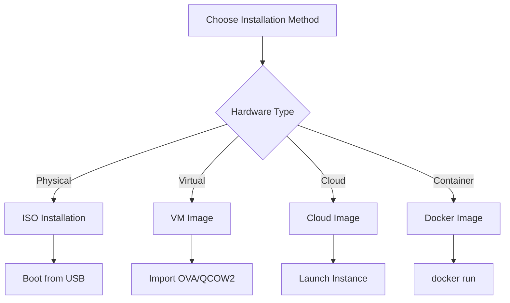

# Installation

This guide covers installing CX Linux on physical hardware, virtual machines, and cloud platforms.

## Installation Methods



## ISO Installation

### Download

Download the latest stable ISO from the official releases page:

```bash
# Download ISO
curl -LO https://releases.cortexlinux.com/stable/cx-2024.1.iso

# Download checksum
curl -LO https://releases.cortexlinux.com/stable/cx-2024.1.iso.sha256

# Verify integrity
sha256sum -c cx-2024.1.iso.sha256
```

### Create Bootable USB

=== "Linux"

    ```bash
    # Identify your USB device
    lsblk

    # Write ISO to USB (replace /dev/sdX with your device)
    sudo dd if=cx-2024.1.iso of=/dev/sdX bs=4M status=progress oflag=sync

    # Sync and safely eject
    sync
    sudo eject /dev/sdX
    ```

=== "macOS"

    ```bash
    # List disks to identify USB
    diskutil list

    # Unmount the USB disk
    diskutil unmountDisk /dev/diskN

    # Write ISO
    sudo dd if=cx-2024.1.iso of=/dev/rdiskN bs=4m

    # Eject
    diskutil eject /dev/diskN
    ```

=== "Windows"

    Use [Rufus](https://rufus.ie/) or [balenaEtcher](https://www.balena.io/etcher/):

    1. Download and run Rufus
    2. Select the Cortex ISO
    3. Select your USB drive
    4. Click "Start"

### Boot and Install

1. **Boot from USB**: Insert the USB drive and boot your system. Access BIOS/UEFI (usually F2, F12, or DEL) and select USB as boot device.

2. **Select Installation Mode**:
    - **Guided Install**: Recommended for most users
    - **Expert Install**: Full control over partitioning
    - **Server Install**: Minimal installation without GUI

3. **Configure Disk**:
    ```
    ┌─────────────────────────────────────────┐
    │ Disk Configuration                       │
    ├─────────────────────────────────────────┤
    │ ○ Use entire disk (recommended)         │
    │ ○ Use entire disk with LVM              │
    │ ○ Use entire disk with ZFS              │
    │ ○ Manual partitioning                   │
    └─────────────────────────────────────────┘
    ```

4. **Set Up User Account**:
    - Username and password
    - SSH key import (optional)
    - Enable root account (optional, not recommended)

5. **Select Components**:
    ```
    [x] CX CLI (required)
    [x] CX Ops
    [ ] CX LLM (requires GPU)
    [x] CX Security
    [ ] CX Stacks (Kubernetes)
    [ ] CX Observe (monitoring)
    ```

6. **Complete Installation**: The installer will partition disks, install packages, and configure the bootloader. This typically takes 5-15 minutes.

## Virtual Machine Installation

### VMware / VirtualBox

Download the OVA image:

```bash
curl -LO https://releases.cortexlinux.com/stable/cx-2024.1.ova
```

Import into your hypervisor:

=== "VMware"

    ```
    File → Open → Select cx-2024.1.ova
    ```

    Recommended settings:

    | Setting | Value |
    |---------|-------|
    | CPUs | 4+ |
    | Memory | 8192 MB |
    | Disk | 64 GB (thin provisioned) |
    | Network | Bridged or NAT |

=== "VirtualBox"

    ```
    File → Import Appliance → Select cx-2024.1.ova
    ```

### QEMU / KVM

Download the QCOW2 image:

```bash
curl -LO https://releases.cortexlinux.com/stable/cx-2024.1.qcow2
```

Create and start VM:

```bash
# Create VM with virt-install
virt-install \
  --name cx \
  --memory 8192 \
  --vcpus 4 \
  --disk path=cx-2024.1.qcow2,format=qcow2 \
  --import \
  --os-variant ubuntu22.04 \
  --network bridge=virbr0

# Or start directly with QEMU
qemu-system-x86_64 \
  -enable-kvm \
  -m 8G \
  -smp 4 \
  -drive file=cx-2024.1.qcow2,format=qcow2 \
  -net nic -net user,hostfwd=tcp::2222-:22
```

## Cloud Installation

### Amazon Web Services (AWS)

```bash
# Find the latest Cortex AMI
aws ec2 describe-images \
  --owners 123456789012 \
  --filters "Name=name,Values=cx-*" \
  --query 'Images | sort_by(@, &CreationDate) | [-1]'

# Launch instance
aws ec2 run-instances \
  --image-id ami-0123456789abcdef0 \
  --instance-type t3.xlarge \
  --key-name your-key \
  --security-group-ids sg-0123456789abcdef0 \
  --subnet-id subnet-0123456789abcdef0

# For GPU workloads
aws ec2 run-instances \
  --image-id ami-0123456789abcdef0 \
  --instance-type p3.2xlarge \
  --key-name your-key
```

### Google Cloud Platform (GCP)

```bash
# Create instance
gcloud compute instances create cx-vm \
  --image-family=cx-stable \
  --image-project=cortexlinux \
  --machine-type=n2-standard-4 \
  --boot-disk-size=100GB \
  --zone=us-central1-a

# For GPU workloads
gcloud compute instances create cx-gpu \
  --image-family=cx-stable \
  --image-project=cortexlinux \
  --machine-type=n1-standard-8 \
  --accelerator=type=nvidia-tesla-t4,count=1 \
  --maintenance-policy=TERMINATE \
  --zone=us-central1-a
```

### Microsoft Azure

```bash
# Create resource group
az group create --name cx-rg --location eastus

# Create VM
az vm create \
  --resource-group cx-rg \
  --name cx-vm \
  --image cortexlinux:cortex:stable:latest \
  --size Standard_D4s_v3 \
  --admin-username cx \
  --generate-ssh-keys

# For GPU workloads
az vm create \
  --resource-group cx-rg \
  --name cx-gpu \
  --image cortexlinux:cortex:stable:latest \
  --size Standard_NC6s_v3 \
  --admin-username cx \
  --generate-ssh-keys
```

## Container Installation

### Docker

```bash
# Pull the latest image
docker pull cortexlinux/cortex:latest

# Run interactive shell
docker run -it cortexlinux/cortex

# Run with GPU support (NVIDIA)
docker run --gpus all -it cortexlinux/cortex

# Run with persistent storage
docker run -it \
  -v cx-data:/var/lib/cx \
  -v cx-config:/etc/cx \
  cortexlinux/cortex
```

### Podman

```bash
# Pull and run
podman pull docker.io/cortexlinux/cortex:latest
podman run -it cortexlinux/cortex
```

## Post-Installation

After installation, verify your system:

```bash
# Check Cortex version
cx --version

# Run system diagnostics
cx-ops doctor

# View system status
cx status
```

Continue to [Quick Start](quickstart.md) to begin using CX Linux.

## Troubleshooting Installation

### Boot Issues

!!! warning "UEFI Secure Boot"
    CX Linux supports Secure Boot, but you may need to enroll the Cortex signing key in your UEFI firmware.

```bash
# Check if booted in UEFI mode
[ -d /sys/firmware/efi ] && echo "UEFI" || echo "BIOS"

# Enroll MOK key (if prompted)
mokutil --import /var/lib/shim-signed/mok/MOK.der
```

### GPU Not Detected

```bash
# Check for NVIDIA GPU
lspci | grep -i nvidia

# Install NVIDIA drivers
sudo apt install nvidia-driver-535

# Verify installation
nvidia-smi
```

### Network Issues

```bash
# Check network interfaces
ip link show

# Restart networking
sudo systemctl restart NetworkManager

# Check DNS resolution
dig cortexlinux.com
```
