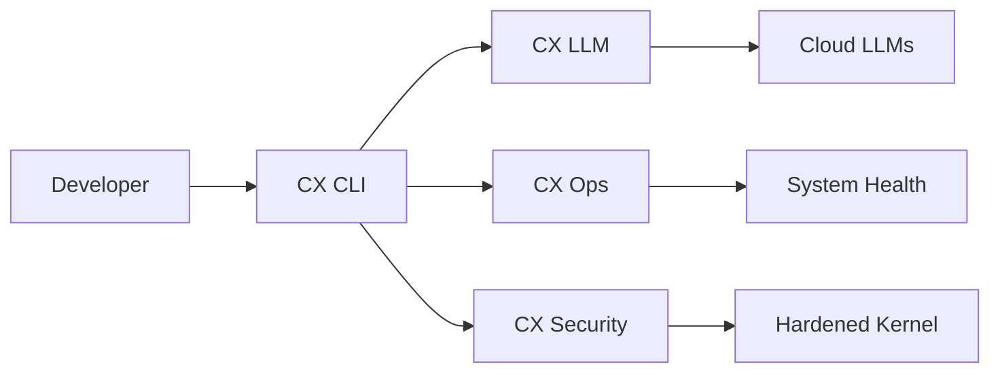

# CX Linux

**The AI-Native Operating System**

CX Linux is a purpose-built operating system designed for AI workloads, providing integrated tooling for machine learning, LLM orchestration, and intelligent system management.



## Why CX Linux?

| Feature | Description |
|---------|-------------|
| **AI-First Design** | Native LLM integration, GPU optimization, and ML frameworks pre-configured |
| **Security Hardened** | AppArmor profiles, SELinux policies, and secure boot by default |
| **Operations Ready** | Built-in monitoring, diagnostics, and automated repair tools |
| **Developer Friendly** | Modern CLI with Rich output, plugin architecture, and extensive APIs |

## Quick Start

=== "Install from ISO"

    ```bash
    # Download the latest ISO
    curl -LO https://releases.cortexlinux.com/stable/cx-latest.iso

    # Verify checksum
    sha256sum -c cx-latest.iso.sha256

    # Flash to USB (replace /dev/sdX)
    sudo dd if=cx-latest.iso of=/dev/sdX bs=4M status=progress
    ```

=== "Cloud Image"

    ```bash
    # AWS
    aws ec2 run-instances --image-id ami-cx-latest

    # GCP
    gcloud compute instances create cx-vm \
      --image-family=cx-stable

    # Azure
    az vm create --image cortexlinux:cortex:stable:latest
    ```

=== "Container"

    ```bash
    docker pull cortexlinux/cortex:latest
    docker run -it cortexlinux/cortex
    ```

## Core Components

<div class="grid cards" markdown>

-   :material-console:{ .lg .middle } **CX CLI**

    ---

    Unified command-line interface for all Cortex operations

    [:octicons-arrow-right-24: Learn more](architecture/cx-cli.md)

-   :material-brain:{ .lg .middle } **CX LLM**

    ---

    Local and cloud LLM orchestration with intelligent routing

    [:octicons-arrow-right-24: Learn more](architecture/cx-llm.md)

-   :material-shield-check:{ .lg .middle } **CX Security**

    ---

    Hardened security posture with automated compliance

    [:octicons-arrow-right-24: Learn more](architecture/cx-security.md)

-   :material-tools:{ .lg .middle } **CX Ops**

    ---

    System diagnostics, repair tools, and update management

    [:octicons-arrow-right-24: Learn more](architecture/cx-ops.md)

</div>

## System Requirements

### Minimum

| Component | Requirement |
|-----------|-------------|
| CPU | 4 cores (x86_64 or ARM64) |
| RAM | 8 GB |
| Storage | 32 GB SSD |
| Network | 1 Gbps |

### Recommended (AI Workloads)

| Component | Requirement |
|-----------|-------------|
| CPU | 16+ cores |
| RAM | 64 GB+ |
| GPU | NVIDIA RTX 3080+ or A100 |
| Storage | 500 GB NVMe |
| Network | 10 Gbps |

## Getting Help

- **Documentation**: You're here!
- **GitHub Issues**: [cortexlinux/cortex](https://github.com/cortexlinux/cortex/issues)
- **Discord**: [Join our community](https://discord.gg/cortexlinux)
- **Enterprise Support**: [contact@cortexlinux.com](mailto:contact@cortexlinux.com)

## License

CX Linux is open source software released under the Apache 2.0 license.
