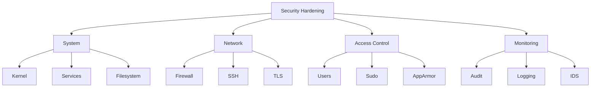

# Security Hardening Guide

Comprehensive security hardening procedures for CX Linux systems.

## Hardening Overview



## Quick Hardening

Run the automated hardening script:

```bash
cx-security harden

# This applies:
# ✓ Disable root SSH login
# ✓ Configure SSH key-only auth
# ✓ Enable UFW firewall
# ✓ Configure fail2ban
# ✓ Enable auditd
# ✓ Set secure file permissions
# ✓ Disable unused services
# ✓ Configure automatic updates
# ✓ Enable AppArmor
# ✓ Apply kernel hardening
```

---

## System Hardening

### Kernel Security

Apply kernel hardening parameters in `/etc/sysctl.d/99-security.conf`:

```ini
# Prevent IP spoofing
net.ipv4.conf.all.rp_filter = 1
net.ipv4.conf.default.rp_filter = 1

# Ignore ICMP broadcast requests
net.ipv4.icmp_echo_ignore_broadcasts = 1

# Disable source packet routing
net.ipv4.conf.all.accept_source_route = 0
net.ipv4.conf.default.accept_source_route = 0
net.ipv6.conf.all.accept_source_route = 0
net.ipv6.conf.default.accept_source_route = 0

# Ignore send redirects
net.ipv4.conf.all.send_redirects = 0
net.ipv4.conf.default.send_redirects = 0

# Block SYN attacks
net.ipv4.tcp_syncookies = 1
net.ipv4.tcp_max_syn_backlog = 2048
net.ipv4.tcp_synack_retries = 2
net.ipv4.tcp_syn_retries = 5

# Log martians
net.ipv4.conf.all.log_martians = 1
net.ipv4.conf.default.log_martians = 1

# Ignore ICMP redirects
net.ipv4.conf.all.accept_redirects = 0
net.ipv4.conf.default.accept_redirects = 0
net.ipv6.conf.all.accept_redirects = 0
net.ipv6.conf.default.accept_redirects = 0

# Disable IPv6 if not needed
net.ipv6.conf.all.disable_ipv6 = 1
net.ipv6.conf.default.disable_ipv6 = 1

# ASLR
kernel.randomize_va_space = 2

# Restrict dmesg
kernel.dmesg_restrict = 1

# Restrict kernel pointers
kernel.kptr_restrict = 2

# Restrict perf events
kernel.perf_event_paranoid = 3

# Disable magic SysRq
kernel.sysrq = 0
```

Apply changes:

```bash
sudo sysctl --system
```

### Disable Unused Services

```bash
# List enabled services
systemctl list-unit-files --state=enabled

# Disable unnecessary services
sudo systemctl disable --now avahi-daemon
sudo systemctl disable --now cups
sudo systemctl disable --now bluetooth

# Mask services to prevent starting
sudo systemctl mask bluetooth
```

### Filesystem Security

```bash
# Secure /tmp with separate mount
echo "tmpfs /tmp tmpfs defaults,noexec,nosuid,nodev 0 0" >> /etc/fstab

# Secure /var/tmp
echo "tmpfs /var/tmp tmpfs defaults,noexec,nosuid,nodev 0 0" >> /etc/fstab

# Set sticky bit on world-writable directories
chmod +t /tmp /var/tmp

# Find world-writable files
find / -xdev -type f -perm -0002 -exec ls -l {} \;

# Find SUID/SGID files
find / -xdev \( -perm -4000 -o -perm -2000 \) -type f -exec ls -l {} \;

# Remove unnecessary SUID bits
chmod u-s /usr/bin/unnecessary-suid-binary
```

---

## Network Security

### Firewall Configuration

```bash
# Enable UFW
sudo ufw enable

# Set default policies
sudo ufw default deny incoming
sudo ufw default allow outgoing

# Allow SSH (restrict to specific IPs in production)
sudo ufw allow from 10.0.0.0/8 to any port 22

# Allow HTTPS
sudo ufw allow 443/tcp

# Allow specific services
sudo ufw allow from 192.168.1.0/24 to any port 8080

# Enable logging
sudo ufw logging on

# View rules
sudo ufw status verbose
```

### SSH Hardening

Edit `/etc/ssh/sshd_config`:

```
# Disable root login
PermitRootLogin no

# Use SSH protocol 2 only
Protocol 2

# Disable password authentication
PasswordAuthentication no
PubkeyAuthentication yes
AuthenticationMethods publickey

# Disable empty passwords
PermitEmptyPasswords no

# Limit users
AllowUsers admin deploy

# Disable X11 forwarding
X11Forwarding no

# Disable TCP forwarding
AllowTcpForwarding no
AllowStreamLocalForwarding no
GatewayPorts no
PermitTunnel no

# Set login grace time
LoginGraceTime 30

# Limit authentication attempts
MaxAuthTries 3
MaxSessions 2

# Set idle timeout
ClientAliveInterval 300
ClientAliveCountMax 2

# Use strong ciphers
Ciphers chacha20-poly1305@openssh.com,aes256-gcm@openssh.com,aes128-gcm@openssh.com,aes256-ctr,aes192-ctr,aes128-ctr
MACs hmac-sha2-512-etm@openssh.com,hmac-sha2-256-etm@openssh.com,hmac-sha2-512,hmac-sha2-256
KexAlgorithms curve25519-sha256,curve25519-sha256@libssh.org,diffie-hellman-group16-sha512,diffie-hellman-group18-sha512

# Log level
LogLevel VERBOSE
```

Restart SSH:

```bash
sudo sshd -t  # Test config
sudo systemctl restart sshd
```

### TLS Configuration

For web services, use strong TLS settings:

```nginx
# /etc/nginx/conf.d/ssl.conf
ssl_protocols TLSv1.2 TLSv1.3;
ssl_prefer_server_ciphers on;
ssl_ciphers 'ECDHE-ECDSA-AES128-GCM-SHA256:ECDHE-RSA-AES128-GCM-SHA256:ECDHE-ECDSA-AES256-GCM-SHA384:ECDHE-RSA-AES256-GCM-SHA384';
ssl_session_timeout 1d;
ssl_session_cache shared:SSL:50m;
ssl_session_tickets off;
ssl_stapling on;
ssl_stapling_verify on;
add_header Strict-Transport-Security "max-age=63072000" always;
```

---

## Access Control

### User Account Security

```bash
# Set password policies
# /etc/security/pwquality.conf
minlen = 14
dcredit = -1
ucredit = -1
ocredit = -1
lcredit = -1
difok = 3
maxrepeat = 3
usercheck = 1
enforcing = 1

# Set password aging
# /etc/login.defs
PASS_MAX_DAYS 90
PASS_MIN_DAYS 1
PASS_WARN_AGE 14

# Lock inactive accounts
useradd -D -f 30

# Disable unused accounts
usermod -L -e 1 unused-user
```

### Sudo Security

```bash
# /etc/sudoers.d/security

# Require password for sudo
Defaults timestamp_timeout=5
Defaults passwd_timeout=1
Defaults passwd_tries=3

# Log all sudo commands
Defaults logfile=/var/log/sudo.log
Defaults log_input, log_output

# Restrict sudo to specific commands
%operators ALL=(ALL) /usr/bin/systemctl restart nginx, /usr/bin/cx-ops doctor

# Require re-authentication for sensitive commands
Defaults!/usr/bin/su requiretty
```

### AppArmor Profiles

```bash
# Check AppArmor status
aa-status

# Enable profile
aa-enforce /etc/apparmor.d/usr.sbin.nginx

# Create custom profile
aa-genprof /path/to/application
```

Example profile:

```
#include <tunables/global>

profile myapp /usr/local/bin/myapp {
  #include <abstractions/base>

  /usr/local/bin/myapp mr,
  /etc/myapp/** r,
  /var/lib/myapp/** rw,
  /var/log/myapp/** w,

  network inet stream,

  deny /etc/passwd w,
  deny /etc/shadow rw,
}
```

---

## Security Monitoring

### Audit Configuration

```bash
# Install auditd
sudo apt install auditd

# Configure rules
# /etc/audit/rules.d/cx.rules

# Monitor authentication
-w /etc/passwd -p wa -k identity
-w /etc/shadow -p wa -k identity
-w /etc/group -p wa -k identity
-w /etc/gshadow -p wa -k identity
-w /etc/sudoers -p wa -k sudoers
-w /etc/sudoers.d/ -p wa -k sudoers

# Monitor commands
-a always,exit -F arch=b64 -S execve -F euid=0 -k root_commands

# Monitor network
-a always,exit -F arch=b64 -S socket -F a0=2 -k network
-a always,exit -F arch=b64 -S connect -k network

# Monitor file access
-a always,exit -F arch=b64 -S open -F dir=/etc -F success=0 -k access
-a always,exit -F arch=b64 -S unlink -S rmdir -k delete

# Reload rules
sudo augenrules --load
```

### Intrusion Detection

```bash
# Install AIDE
sudo apt install aide

# Initialize database
sudo aideinit

# Run check
sudo aide --check

# Configure daily checks
echo "0 5 * * * root /usr/bin/aide --check | mail -s 'AIDE Report' security@example.com" > /etc/cron.d/aide
```

### Fail2ban

```ini
# /etc/fail2ban/jail.local
[DEFAULT]
bantime = 1h
findtime = 10m
maxretry = 5
banaction = ufw

[sshd]
enabled = true
port = ssh
filter = sshd
logpath = /var/log/auth.log
maxretry = 3
bantime = 24h

[nginx-http-auth]
enabled = true
port = http,https
filter = nginx-http-auth
logpath = /var/log/nginx/error.log

[cx-api]
enabled = true
port = 8080
filter = cx-api
logpath = /var/log/cx/access.log
maxretry = 10
```

```bash
sudo systemctl enable fail2ban
sudo systemctl start fail2ban
sudo fail2ban-client status
```

---

## Secrets Management

### Environment Variables

Never store secrets in:
- Code repositories
- Shell history
- Configuration files

Instead use:

```bash
# Systemd credentials
systemd-creds encrypt --name=api-key secret.txt api-key.cred

# Environment file (restricted permissions)
chmod 600 /etc/cx/env
chown root:root /etc/cx/env
```

### HashiCorp Vault

```bash
# Install Vault
curl -fsSL https://apt.releases.hashicorp.com/gpg | sudo apt-key add -
sudo apt-add-repository "deb [arch=amd64] https://apt.releases.hashicorp.com $(lsb_release -cs) main"
sudo apt update && sudo apt install vault

# Start in dev mode (production requires proper setup)
vault server -dev

# Store secret
vault kv put secret/cx/api-keys openai=sk-xxx anthropic=sk-ant-xxx

# Read secret
vault kv get secret/cx/api-keys
```

---

## Security Checklist

### Initial Setup

- [ ] Update all packages
- [ ] Enable automatic security updates
- [ ] Configure firewall
- [ ] Harden SSH
- [ ] Disable root login
- [ ] Create admin user with sudo
- [ ] Enable audit logging
- [ ] Configure fail2ban

### Ongoing

- [ ] Review logs weekly
- [ ] Run vulnerability scans monthly
- [ ] Update software regularly
- [ ] Rotate credentials quarterly
- [ ] Review user accounts monthly
- [ ] Test backups regularly
- [ ] Review firewall rules quarterly

### Before Production

- [ ] Remove development tools
- [ ] Disable debug modes
- [ ] Enable all security features
- [ ] Conduct penetration test
- [ ] Document security procedures
- [ ] Set up monitoring alerts

---

## Verification

```bash
# Run security scan
cx-security scan --benchmark cis

# Check open ports
ss -tlnp

# Check running services
systemctl list-units --type=service --state=running

# Check for updates
apt list --upgradable

# Review recent authentications
last -n 20
lastb -n 20

# Check audit log
ausearch -ts recent
```
