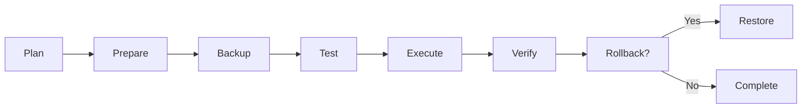

# Upgrade Guide

Procedures for upgrading Cortex Linux systems safely.

## Upgrade Overview



## Pre-Upgrade Checklist

Before starting any upgrade:

- [ ] Review release notes for breaking changes
- [ ] Check system requirements for new version
- [ ] Verify current system health
- [ ] Create full backup
- [ ] Schedule maintenance window
- [ ] Notify stakeholders
- [ ] Prepare rollback plan

---

## Package Updates

### Security Updates

Apply security updates promptly:

```bash
# Check for security updates
cortex-ops update check

# Apply security updates only
cortex-ops update apply --packages --security -y

# Or manually
sudo apt update
sudo apt upgrade -s  # Simulate first
sudo apt upgrade
```

### Regular Updates

For regular package updates:

```bash
# Check what will be updated
apt list --upgradable

# Apply all updates
cortex-ops update apply --packages

# Or manually
sudo apt update
sudo apt full-upgrade
```

### Kernel Updates

Kernel updates require a reboot:

```bash
# Check current kernel
uname -r

# List available kernels
apt list linux-image-*

# Update kernel
sudo apt install linux-image-generic

# Reboot to apply
sudo reboot
```

---

## Major Version Upgrades

### Cortex Linux Release Upgrade

```bash
# 1. Update current system fully
sudo apt update && sudo apt full-upgrade

# 2. Check upgrade availability
cortex-ops update check

# 3. Create backup
cortex-ops update apply --system  # Creates automatic snapshot

# Or use do-release-upgrade
sudo do-release-upgrade
```

### Step-by-Step Upgrade

#### Phase 1: Preparation

```bash
# Check current version
cat /etc/cortex/version

# Review release notes
curl https://releases.cortexlinux.com/2024.2/notes.md

# Check disk space (need at least 10GB free)
df -h /

# Check for held packages
apt-mark showhold

# Remove holds if safe
apt-mark unhold package-name
```

#### Phase 2: Backup

```bash
# Create snapshot
cortex-ops update rollback --list  # Note current snapshots

# Manual backup of critical data
tar -czvf /backup/pre-upgrade-$(date +%Y%m%d).tar.gz \
    /etc/cortex \
    /var/lib/cortex

# Export database if applicable
pg_dumpall > /backup/databases-pre-upgrade.sql
```

#### Phase 3: Upgrade

```bash
# Run the upgrade
cortex-ops update apply --system

# Or manually:
sudo apt update
sudo apt full-upgrade
sudo do-release-upgrade

# Follow prompts carefully
# - Keep modified config files (unless you know the new defaults are needed)
# - Review service restarts
```

#### Phase 4: Post-Upgrade

```bash
# Verify version
cat /etc/cortex/version

# Check for issues
cortex-ops doctor

# Restart critical services
sudo systemctl restart cortex

# Verify services
systemctl status cortex

# Check logs for errors
journalctl -p err -n 50
```

---

## Component Upgrades

### Cortex CLI Upgrade

```bash
# Via pip
pip install --upgrade cortex-ops

# Via apt
sudo apt update
sudo apt install cortex-ops
```

### Cortex LLM Upgrade

```bash
# Upgrade connector libraries
pip install --upgrade openai anthropic google-generativeai

# Update configuration if needed
nano /etc/cortex/config.yaml
```

### Container Runtime Upgrade

```bash
# Docker
sudo apt update
sudo apt install docker-ce docker-ce-cli containerd.io

# Restart containers after upgrade
docker compose down
docker compose up -d
```

### Kubernetes Upgrade

```bash
# K3s upgrade
curl -sfL https://get.k3s.io | sh -

# Or specific version
curl -sfL https://get.k3s.io | INSTALL_K3S_VERSION=v1.28.0+k3s1 sh -

# Verify
kubectl version
```

---

## Rolling Upgrades

For clustered deployments:

### Node-by-Node Upgrade

```bash
# 1. Cordon node
kubectl cordon node-1

# 2. Drain workloads
kubectl drain node-1 --ignore-daemonsets --delete-emptydir-data

# 3. SSH to node and upgrade
ssh node-1
cortex-ops update apply --packages -y
sudo reboot

# 4. Verify node
kubectl get node node-1

# 5. Uncordon node
kubectl uncordon node-1

# 6. Repeat for remaining nodes
```

### Blue-Green Deployment

```bash
# 1. Deploy new version alongside old
kubectl apply -f deployment-v2.yaml

# 2. Verify new deployment
kubectl rollout status deployment/app-v2

# 3. Switch traffic
kubectl patch service app -p '{"spec":{"selector":{"version":"v2"}}}'

# 4. Monitor
kubectl logs -l version=v2 -f

# 5. Remove old deployment (after verification)
kubectl delete deployment app-v1
```

---

## Rollback Procedures

### Using Cortex Snapshots

```bash
# List snapshots
cortex-ops update rollback --list

# Rollback to latest
cortex-ops update rollback

# Rollback to specific snapshot
cortex-ops update rollback 20240115-120000
```

### Manual Rollback

```bash
# Downgrade package
sudo apt install package-name=old-version

# Restore from backup
tar -xzf /backup/pre-upgrade.tar.gz -C /

# Restore database
psql < /backup/databases-pre-upgrade.sql

# Restart services
sudo systemctl restart cortex
```

### Kernel Rollback

```bash
# At boot, select GRUB > Advanced options
# Choose previous kernel version

# Or set default kernel
sudo nano /etc/default/grub
# Set: GRUB_DEFAULT="1>2"  # Advanced > 3rd kernel
sudo update-grub
sudo reboot
```

---

## Upgrade Automation

### Automatic Security Updates

```bash
# Install unattended-upgrades
sudo apt install unattended-upgrades

# Configure
sudo dpkg-reconfigure -plow unattended-upgrades

# Edit configuration
sudo nano /etc/apt/apt.conf.d/50unattended-upgrades
```

```
// /etc/apt/apt.conf.d/50unattended-upgrades
Unattended-Upgrade::Allowed-Origins {
    "${distro_id}:${distro_codename}-security";
};

Unattended-Upgrade::AutoFixInterruptedDpkg "true";
Unattended-Upgrade::MinimalSteps "true";
Unattended-Upgrade::Mail "admin@example.com";
Unattended-Upgrade::Automatic-Reboot "false";
```

### Scheduled Upgrades

```bash
# /etc/cron.d/cortex-upgrade
# Weekly package updates on Sunday at 3 AM
0 3 * * 0 root cortex-ops update apply --packages --security -y >> /var/log/cortex/upgrade.log 2>&1
```

---

## Troubleshooting Upgrades

### Upgrade Failed Midway

```bash
# Fix dpkg
sudo dpkg --configure -a

# Fix dependencies
sudo apt --fix-broken install

# Resume upgrade
sudo apt full-upgrade
```

### Service Won't Start After Upgrade

```bash
# Check logs
journalctl -u service-name -n 100

# Check config changes
diff /etc/service/config /etc/service/config.dpkg-old

# Restore old config if needed
cp /etc/service/config.dpkg-old /etc/service/config

# Restart
sudo systemctl restart service-name
```

### Package Conflicts

```bash
# Identify conflicts
apt-cache policy package-name

# Remove conflicting package
sudo apt remove conflicting-package

# Install correct version
sudo apt install package-name=version
```

### Out of Disk Space During Upgrade

```bash
# Clean up
sudo apt clean
sudo apt autoremove

# Remove old kernels
sudo apt purge $(dpkg -l 'linux-*' | awk '/^ii/{print $2}' | grep -v $(uname -r | sed 's/-generic//'))

# Resume upgrade
sudo apt full-upgrade
```

---

## Post-Upgrade Verification

### Verification Checklist

```bash
#!/bin/bash
# /usr/local/bin/verify-upgrade.sh

echo "=== System Version ==="
cat /etc/cortex/version

echo "=== Kernel ==="
uname -r

echo "=== Health Check ==="
cortex-ops doctor --json | jq '.summary'

echo "=== Failed Services ==="
systemctl --failed

echo "=== Recent Errors ==="
journalctl -p err -n 10

echo "=== Disk Space ==="
df -h /

echo "=== Critical Services ==="
for service in sshd cortex docker; do
    systemctl is-active $service
done
```

### Application Testing

```bash
# Test API endpoints
curl -s http://localhost:8080/health | jq

# Test critical workflows
cortex-ops connectors test

# Run integration tests if available
./run-tests.sh
```

---

## Best Practices

1. **Never upgrade production without testing in staging first**
2. **Always have a rollback plan before starting**
3. **Schedule upgrades during low-traffic periods**
4. **Monitor closely for 24 hours after upgrade**
5. **Keep upgrade documentation updated**
6. **Automate what you can, but review before applying**
7. **Subscribe to security mailing lists for early warnings**
